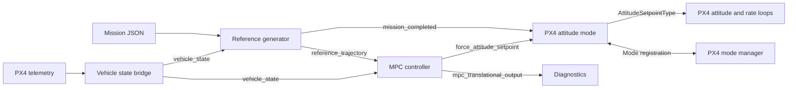
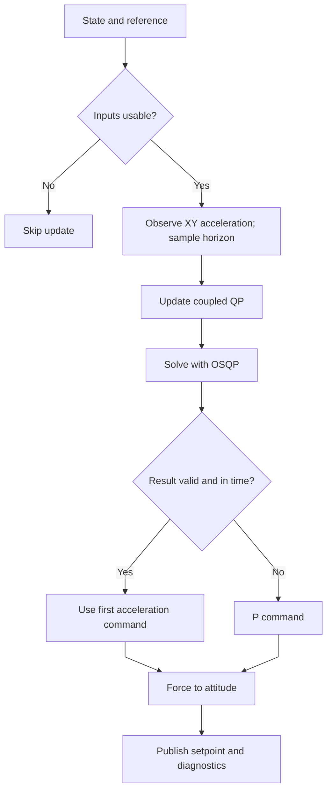

# MPC Controller for PX4 (Native External Attitude Mode)

A ROS 2 translational MPC for PX4 External Mode. The current backend solves
one coupled, convex 3D quadratic program with OSQP 1.0.0.

This document describes the checked-in implementation and the profile in
[controller.yaml](config/controller.yaml). Launch/parameter overrides can change
runtime values. The Makefile defaults to ROS 2 Jazzy and Gazebo gz_x500.

## 1. System Architecture

The MPC profile launches four nodes. The force-to-attitude mapping runs inside
the controller node; the PX4 adapter converts frames and normalizes thrust.



| Interface | Message / purpose |
| --- | --- |
| PX4 → bridge | VehicleLocalPosition, VehicleAttitude, VehicleAngularVelocity |
| vehicle_state | VehicleState: ENU position, velocity, acceleration; orientation, rates and validity |
| reference_trajectory | ReferenceTrajectory: timed position, velocity, acceleration, yaw and yaw rate |
| force_attitude_setpoint | ForceAttitudeSetpoint: desired FLU→ENU quaternion, collective specific force and yaw rate |
| mpc_translational_output | MpcTranslationalOutput: commands, prediction and solver diagnostics; not the adapter input |
| /reference_generator_node/mission_completed | Bool; the MPC adapter reports External Mode completion, not an explicit landing command |

Default bridge input topics are /fmu/out/vehicle_local_position_v1,
/fmu/out/vehicle_attitude and /fmu/out/vehicle_angular_velocity.

## 2. Controller Execution

The controller callback runs at 50 Hz.



- Stale state/reference inputs skip the update and reset solver/observer memory
  when entering a stale interval. 
- The XY acceleration observer blends the previous-command response model with
  measured acceleration. Z acceleration remains measured.
- The reference generator publishes a 30 s horizon at 0.1 s spacing (301 samples).
  The solver independently samples **26 prediction stages**: first step 0.01 s,
  remaining 25 steps 0.20 s. So it's 5.01 s state prediction
- Solver budget: 18 ms; maximum iterations: 400.

Sources: [controller node](src/controller/mpc_controller_node.cpp),
[controller and sampler](include/mpc_controller/controller/translational_mpc.hpp),
[solver](src/solver/osqp_solver.cpp).

## 3. Mathematical Formulation

### 3.1 State and acceleration-response model

```math
\mathbf{x}=[\mathbf{p}^\top,\mathbf{v}^\top,\mathbf{a}^\top]^\top\in\mathbb{R}^9,
\qquad \mathbf{u}=[u_x,u_y,u_z]^\top\in\mathbb{R}^3
```

Both a and u have units m/s²: a is the response state, u is the requested
acceleration. The continuous model motivating the response lag, per axis, is:

```math
\dot p=v,\qquad \dot v=a,\qquad \dot a=(u-a)/\tau
```

The configured time constants are [0.25, 0.25, 0.08] s. They are model parameters
to verify against the target system's response, not the controller period.

**The discrete model actually implemented** uses the next acceleration for the
position/velocity update:

```math
\alpha_i=e^{-\Delta t/\tau_i},\quad b_i=1-\alpha_i
```
```math
a_{i,k+1}=\alpha_i a_{i,k}+b_i u_{i,k},\qquad
v_{i,k+1}=v_{i,k}+\Delta t\,a_{i,k+1},\qquad
p_{i,k+1}=p_{i,k}+\Delta t\,v_{i,k}+\tfrac12\Delta t^2a_{i,k+1}
```
```math
A_i=
\begin{bmatrix}
1&\Delta t&\tfrac12\Delta t^2\alpha_i\\
0&1&\Delta t\alpha_i\\
0&0&\alpha_i
\end{bmatrix},
\qquad
B_i=
\begin{bmatrix}
\tfrac12\Delta t^2b_i\\ \Delta t b_i\\ b_i
\end{bmatrix}
```

For tau_i = 0 the code sets alpha_i = 0. The acceleration update is the exact
constant-input first-order response; the position/velocity updates above are
not the exact integration of the full continuous model.

The per-axis dynamics are independent. XY command limits and XYZ tilt
constraints couple their optimization in one QP.

### 3.2 Decision variables and objective

The solver eliminates predicted states using X = F x_0 + G U. Its decision
vector contains 26x3 = 78 acceleration-command components and 26 + 26 slack variables:

```math
z=[u_0^\top,\ldots,u_{N-1}^\top,s_v^\top,s_a^\top]^\top
\in\mathbb{R}^{130},\qquad N=26
```

Let e_(k+1) = x_(k+1) - x_ref,(k+1). The objective, before positive numerical scaling, is:

```math
J=
\sum_{k=0}^{N-2}\frac{\Delta t_k}{\Delta t_{\mathrm{later}}}
\|e_{k+1}\|_Q^2
+\|e_N\|_S^2
+\sum_{k=0}^{N-1}
\left(\|u_k\|_R^2+\|u_k-u_{k-1}\|_{R_\Delta}^2
+\rho s_{v,k}^2+\rho s_{a,k}^2\right)
```

For k = 0, u_-1 is the controller's stored previous input. Q and S weight
position, velocity and acceleration, with separate XY/Z settings. The last
prediction stage uses terminal weights instead of an additional stage cost.

OSQP solves the resulting convex QP:

```math
\min_z \tfrac12 z^\top Pz+q^\top z,\qquad l\le Cz\le h
```


### 3.3 Hard command limits and soft state limits

Define n_i = [cos(2 pi i/8), sin(2 pi i/8)] for i = 0,...,7 and
c_8 = cos(pi/8). Every polygon inequality below applies for all eight normals.

**Hard acceleration-command and command-rate bounds:**

```math
n_i^\top u_{xy,k}\le c_8 u_{xy,\max},\qquad
|u_{z,k}|\le u_{z,\max}
```
```math
n_i^\top(u_{xy,k}-u_{xy,k-1})
\le c_8\dot u_{xy,\max}\Delta t_k,\qquad
|u_{z,k}-u_{z,k-1}|\le\dot u_{z,\max}\Delta t_k
```

The rate limits have units m/s³. They bound changes of acceleration commands;
u itself is not jerk.

**Soft predicted-state bounds** (v and a here are at stage k+1):

```math
n_i^\top v_{xy}\le c_8v_{xy,\max}+s_{v,k},\qquad
|v_z|\le v_{z,\max}+s_{v,k}
```
```math
n_i^\top a_{xy}\le c_8a_{xy,\max}+s_{a,k},\qquad
|a_z|\le a_{z,\max}+s_{a,k}
```

Both slacks are nonnegative, penalized quadratically, and bounded by
max_constraint_slack (20.0 numerically, in the respective units).
Consequently the nominal velocity/acceleration limits are not hard guarantees.

**Hard total-tilt limit:**

```math
n_i^\top u_{xy,k}
\le c_8\tan(\theta_{\max})(u_{z,k}+g)
```

This is an inscribed polygon approximation of the tilt cone. The configured
35° limit is total thrust-axis tilt, not separate ±45° roll and pitch limits.

**Hard collective-specific-force envelope:**

The desired specific force is f = u + [0,0,g]ᵀ, with units N/kg = m/s².
The solver uses a conservative vertical bound with reserved horizontal force:

```math
f_{\min}\le u_{z,k}+g
\le\sqrt{f_{\max}^2-u_{xy,\max}^2}
```

Together with the horizontal command bound, this ensures ||f|| ≤ f_max.

### 3.4 Acceleration to attitude and PX4 thrust

The first optimal command is applied directly:

```math
a_{\mathrm{des}}=u_0^\star,\qquad
f_{\mathrm{des}}=u_0^\star+[0,0,g]^\top,\qquad
b_3=f_{\mathrm{des}}/\|f_{\mathrm{des}}\|
```

There is no a_0 + u_0*dt integration in the command extraction.
For the requested yaw psi:

```math
x_C=[\cos\psi,\sin\psi,0]^\top,\qquad
b_2=\frac{b_3\times x_C}{\|b_3\times x_C\|},\qquad
b_1=b_2\times b_3,\qquad R_{\mathrm{des}}=[b_1\ b_2\ b_3]
```

[force_attitude_mapper.hpp](include/mpc_controller/px4/force_attitude_mapper.hpp)
checks the force and tilt and constructs the quaternion in the controller node.

The active [PX4 adapter](src/px4/px4_attitude_mode_node.cpp) converts FLU/ENU
to FRD/NED and uses:

```math
T_{\mathrm{norm}}=
\mathrm{clamp}\left(h\,\|f_{\mathrm{des}}\|/9.80665,\;0.05,\;0.95\right),
\qquad \mathbf{T}_{\mathrm{FRD}}=[0,0,-T_{\mathrm{norm}}]^\top
```

## 4. Reference Generation and State Feedback

- Mission JSON is parsed by [mission_json_parser.cpp](src/mission/mission_json_parser.cpp).
  The generator supports takeoff, navigation waypoints, hold and land references.
- /reference_generator_node/start_mission starts reference execution;
  /reference_generator_node/reset_mission resets the generator.
  Starting the reference does not arm or switch PX4 modes.
- The state bridge converts NED/FRD telemetry to ENU/FLU and publishes validity
  information, with 0.25 s freshness and 0.10 s cross-topic skew settings.
  Consumers must honor the appropriate validity checks.

See [mission_trajectory.cpp](src/mission/mission_trajectory.cpp) and
[reference_generator_node.cpp](src/mission/reference_generator_node.cpp).

## 5. Source and Build Architecture

```text
include/mpc_controller/
  mission/       mission models and trajectory interfaces
  controller/    translational MPC and reference sampler
  solver/        coupled QP solver contract
  px4/           state, force/attitude and PID-reference mapping
src/
  mission/       mission parsing and reference node
  controller/    MPC node, observer, recovery and setpoint mapping
  solver/        OSQP implementation
  px4/           state bridge and External Attitude Mode
  PID_validation/ PX4 PID External Mode for validate with mpc
```

## 6. Build and Run

Run from the package root with the ROS and PX4 dependencies available.
The Makefile supports ROS_SETUP, PX4_DIR and PX4_MSGS_SETUP overrides, and checks
its configured PX4 revision and Gazebo version before starting SITL.

```bash
make build
source install/setup.bash

# Start PX4 SITL, Gazebo GUI, DDS and the MPC ROS nodes
make sim CONTROLLER=mpc MISSION_JSON=config/missions/benchmark_square.json
```

Arm and take off manually in a stock PX4 mode, then select the registered
MPC Controller External Mode in QGroundControl. Start reference execution
separately:

```bash
make mission-start
```

make mission-run only prints instructions; it does not start the mission.
The Makefile also contains explicit arm/disarm targets, but these are not part
of the workflow above. Mode selection, arming and landing are not automated by
the reference start service.

For an already prepared ROS/PX4 environment, launch the nodes directly with:

```bash
ros2 launch mpc_controller mpc_external_mode.launch.py \
  controller:=mpc \
  mission_file_path:=/absolute/path/to/mission.json

make status
make logs
make stop
```

## 7. PX4 PID Comparison and Missions

The px4_pid launch profile replaces the MPC/controller-adapter pair with
[pid_mode_node](src/PID_validation/pid_mode_node.cpp). It shares the reference
generator and state bridge, samples the reference at the current time, and
publishes position, velocity, acceleration, yaw and yaw rate at 50 Hz through
TrajectorySetpointType. PX4 owns the feedback loops in this profile.

```bash
make sim CONTROLLER=px4_pid MISSION_JSON=config/missions/test_hover_step.json
# After manual takeoff and selection of PX4 PID:
make mission-start
```

The PID adapter validates frame, timestamps, reference contents and freshness.
Invalid references prevent readiness; loss during operation reports mode failure
and stops new trajectory publication.

| Mission file under config/missions/ | Requested default XY speed | Scenario |
| --- | --- | --- |
| benchmark_square.json | 4 m/s | 50 × 50 m square, altitude 10–15 m |
| benchmark_obstacle_slalom.json | 18 m/s | Alternating lateral waypoints and altitude changes |
| benchmark_urban_canyon.json | 12 m/s | Chicanes, return legs and altitude changes |

These are mission inputs, not achieved speeds or measured MPC-versus-PID
results.

## 8. Current Configuration and Validation

Values below come from [controller.yaml](config/controller.yaml), not the C++
fallback defaults.

| Parameter | Configured value |
| --- | --- |
| update_rate_hz | 50 |
| dt_first / dt_later | 0.01 / 0.20 s |
| model_time_constant_xyz | [0.25, 0.25, 0.08] s |
| q_xy / s_xy | [80, 550, 2] / [100, 600, 4] |
| q_z / s_z | [200, 350, 2] / [300, 400, 4] |
| control_weight_xy / control_weight_z | 1.5 / 4.0 |
| control_rate_weight_xy / control_rate_weight_z | 40 / 10 |
| max_speed_xy / max_speed_z | 18 / 2 m/s (soft) |
| max_acceleration_xy / max_acceleration_z | 6 / 2 m/s² (soft) |
| max_control_xy / max_control_z | 6 / 3 m/s² (hard) |
| max_control_rate_xy / max_control_rate_z | 8 / 4 m/s³ |
| max_tilt | 0.6108652381980153 rad = 35° total tilt |
| min_collective_specific_force_m_s2 / max_collective_specific_force_m_s2 | 1 / 13 m/s² |
| constraint_slack_weight / max_constraint_slack | 10000 / 20 |
| solver_deadline_seconds / max_iterations | 0.018 / 400 |
| coupled_admm_rho | 0.05 |
| solver_absolute_tolerance / solver_relative_tolerance | 0.0003 / 0.001 |
| strict_validation | false |

XY limits use the polygon construction described above, not independent
componentwise boxes. Parameters do not by themselves prove stability or
physical feasibility of every requested maneuver.

Run the CMake-registered tests through colcon:

```bash
colcon test --packages-select mpc_controller
colcon test-result --verbose

# Focused PID reference test after building with tests enabled
ctest --test-dir build/mpc_controller -R pid_reference_test --output-on-failure
```

The registered tests cover PID reference handling, force-to-attitude mapping,
mission trajectory generation and JSON parsing. Passing them does not establish
solver deadline compliance or flight performance. Compare repeated SITL runs
using tracking error, constraint/slack usage, actuator saturation, solver
latency and fallback counts.
