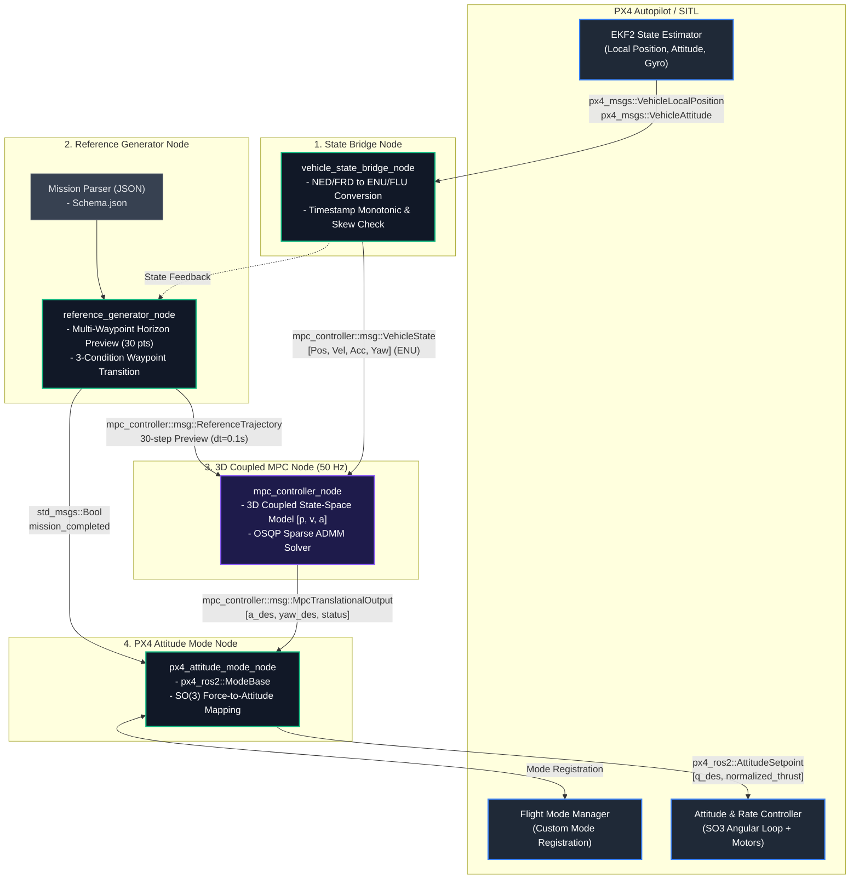
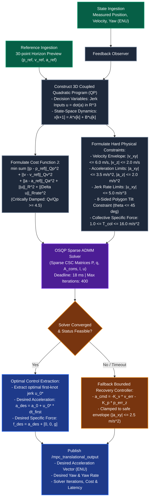

# MPC Controller for PX4 (Native External Attitude Mode)

A high-performance **3D Coupled Model Predictive Controller (MPC)** for multirotors running on **ROS 2 (Jazzy/Humble)** and integrated natively with **PX4 Autopilot** via `px4_ros2_cpp` (External Flight Mode).

---

## 1. System Architecture & Overall Dataflow

The system is organized into a modular 4-node pipeline communicating over high-frequency ROS 2 topics and MicroXRCE-DDS:



---

## 2. Dedicated 3D Coupled MPC Algorithm Flowchart

The internal 50 Hz execution loop of `mpc_controller_node` and `mpc_solver.cpp`:



---

## 3. Mathematical Formulation

### 3.1 State-Space Kinematics & Actuator Lag Model
The 3D translational state vector and control input (Jerk) are defined as:

```math
\mathbf{x} = \begin{bmatrix} \mathbf{p} \\ \mathbf{v} \\ \mathbf{a} \end{bmatrix} \in \mathbb{R}^9, \quad \mathbf{u} = \dot{\mathbf{a}} = \begin{bmatrix} j_x \\ j_y \\ j_z \end{bmatrix} \in \mathbb{R}^3
```

The continuous-time dynamics incorporate a first-order acceleration-response lag reflecting the physical delay of the inner attitude loop:

```math
\dot{\mathbf{p}}(t) = \mathbf{v}(t), \quad \dot{\mathbf{v}}(t) = \mathbf{a}(t), \quad \dot{\mathbf{a}}(t) = -\frac{1}{\boldsymbol{\tau}} \mathbf{a}(t) + \frac{1}{\boldsymbol{\tau}} \mathbf{u}(t)
```

Discretizing with step `dt_k`, using exact integration (`alpha_i = exp(-dt_k / tau_i)`, `b_i = 1 - alpha_i`):

```math
\mathbf{x}_{k+1} = \mathbf{A}(\Delta t_k) \, \mathbf{x}_k + \mathbf{B}(\Delta t_k) \, \mathbf{u}_k
```

The per-axis discrete transition blocks are:

```math
\mathbf{A}_i = \begin{bmatrix} 1 & \Delta t & \tau_i \Delta t - \tau_i^2 b_i \\ 0 & 1 & \tau_i b_i \\ 0 & 0 & \alpha_i \end{bmatrix}, \quad \mathbf{B}_i = \begin{bmatrix} \tfrac{1}{2}\Delta t^2 - \tau_i \Delta t + \tau_i^2 b_i \\ \Delta t - \tau_i b_i \\ b_i \end{bmatrix}
```

---

### 3.2 Quadratic Program (QP) Objective Function
Over a prediction horizon of N steps, the optimal jerk sequence minimizes tracking error and control effort:

```math
\min_{\mathbf{u}_0, \dots, \mathbf{u}_{N-1}} J = \sum_{k=0}^{N-1} \left( \|\mathbf{p}_k - \mathbf{p}_{\text{ref},k}\|_{\mathbf{Q}_p}^2 + \|\mathbf{v}_k - \mathbf{v}_{\text{ref},k}\|_{\mathbf{Q}_v}^2 + \|\mathbf{a}_k - \mathbf{a}_{\text{ref},k}\|_{\mathbf{Q}_a}^2 + \|\mathbf{u}_k\|_{\mathbf{R}}^2 + \|\mathbf{u}_k - \mathbf{u}_{k-1}\|_{\mathbf{R}_\Delta}^2 \right) + \|\mathbf{x}_N - \mathbf{x}_{\text{ref},N}\|_{\mathbf{S}}^2
```

**Critical Damping**: Weights satisfy `Q_v >= 4.5 * Q_p`, eliminating overshoot and S-weaving oscillations after sharp corners.

---

### 3.3 Physical Envelope Constraints
The optimization is subjected to hard linear inequality constraints.

**Velocity Bounds:**

```math
|v_x| \le v_{xy,\max}, \quad |v_y| \le v_{xy,\max}, \quad |v_z| \le v_{z,\max}
```

**Acceleration Bounds:**

```math
|a_x| \le a_{xy,\max}, \quad |a_y| \le a_{xy,\max}, \quad |a_z| \le a_{z,\max}
```

**Jerk & Control Rate Bounds:**

```math
\|\mathbf{u}_k\| \le u_{\max}, \quad \|\mathbf{u}_k - \mathbf{u}_{k-1}\| \le \Delta u_{\max}
```

**8-Sided Polygonal Tilt Constraint** (max tilt = 45 deg):

```math
\mathbf{n}_i^T \, \mathbf{a}_{xy,k} \le g \cdot \tan(\theta_{\max}), \quad \forall\, i \in \{1, \dots, 8\}
```

**Collective Specific Force:**

```math
T_{\min} \le a_{z,k} + g \le T_{\max}
```

---

### 3.4 SO(3) Force-to-Attitude & Thrust Mapping

From the optimal first-knot acceleration:

```math
\mathbf{a}_{\text{des}} = \mathbf{a}_0 + \mathbf{u}_0^{*} \cdot \Delta t_0
```

The desired specific force vector in ENU frame:

```math
\mathbf{f}_{\text{des}} = \mathbf{a}_{\text{des}} + \begin{bmatrix} 0 \\ 0 \\ g \end{bmatrix}, \quad \mathbf{z}_B = \frac{\mathbf{f}_{\text{des}}}{\|\mathbf{f}_{\text{des}}\|}
```

Given the desired yaw angle `psi`, the intermediate heading vector:

```math
\mathbf{x}_C = \begin{bmatrix} \cos(\psi) \\ \sin(\psi) \\ 0 \end{bmatrix}
```

The body orthonormal orientation and target quaternion:

```math
\mathbf{y}_B = \frac{\mathbf{z}_B \times \mathbf{x}_C}{\|\mathbf{z}_B \times \mathbf{x}_C\|}, \quad \mathbf{x}_B = \mathbf{y}_B \times \mathbf{z}_B \;\implies\; \mathbf{q}_{\text{des}} \in \mathbb{H}
```

The normalized collective thrust command:

```math
T_{\text{norm}} = \text{clamp}\!\left( \frac{\|\mathbf{f}_{\text{des}}\|}{g} \cdot T_{\text{hover}},\; 0.05,\; 1.0 \right)
```

---

## 4. Core Package Modules

### 1. `reference_generator_node` (Mission Parser & Horizon Lookahead)
* **Mission Parser**: Parses declarative mission JSON files conforming to the schema (`takeoff`, `waypoint`, `hold`, `land`).
* **Multi-Waypoint Horizon Lookahead**: Samples continuous 30-step ($3\text{ s}$) preview across current and upcoming waypoints, enabling anticipatory banked turns.
* **3-Condition Waypoint Transition**:
  1. *Distance & Hold*: Drone within `acceptance_radius` ($2.5\text{ m}$) and hold timer satisfied.
  2. *Cross-Track Plane Test*: Drone has crossed the normal plane perpendicular to the leg vector (eliminates corner overshooting deadlocks).
  3. *Time-Elapsed Proximity*: Leg duration elapsed and drone within proximity ($< 4.0\text{ m}$).
* **Auto-Landing Handover**: Publishes `/reference_generator_node/mission_completed` upon mission completion to trigger native landing.

### 2. `vehicle_state_bridge_node` (Coordinate & State Conversion)
* **Coordinate Mapping**: Converts PX4 NED/FRD telemetry to standard ROS 2 ENU/FLU frames.
* **Integrity Validation**: Verifies monotonic timestamps and checks cross-topic sample skew ($< 100\text{ ms}$).

### 3. `mpc_controller_node` & `mpc_solver.cpp` (3D Coupled Translational MPC)
* **Kinematic Model**: State vector $\mathbf{x} = [\mathbf{p}, \mathbf{v}, \mathbf{a}]^T \in \mathbb{R}^9$, control input $\mathbf{u} = \dot{\mathbf{a}} \in \mathbb{R}^3$ (Jerk).
* **Actuator Lag Compensation**: First-order time constants $\boldsymbol{\tau}_{xyz} = [0.25, 0.25, 0.08]\text{ s}$ integrated directly into discrete transition matrices $A(\Delta t), B(\Delta t)$.
* **Critically Damped Tuning**: High derivative damping ratio ($Q_{\text{vel}} \ge 4.5 \times Q_{\text{pos}}$) eliminating S-weaving oscillations after sharp corners.

### 4. `px4_attitude_mode_node` (Native PX4 Attitude Mode)
* **Mode Registration**: Registers as an official Custom External Mode with PX4 Flight Mode Manager via `px4_ros2::ModeBase`.
* **$\mathbf{SO}(3)$ Attitude & Thrust Mapping**: Computes desired quaternion $\mathbf{q}_{\text{des}}$ and normalized thrust $[0..1]$ calibrated by PX4's `HoverThrustEstimate`.

---

## 5. Quick Start & Execution Workflow

### Build Package
```bash
make build
source install/setup.bash
```

### Launch Simulation Stack
```bash
# Terminal 1: Start PX4 SITL (Gazebo x500)
make sim

# Terminal 2: Start MicroXRCE-DDS Bridge
make dds

# Terminal 3: Start MPC Controller Stack
make ros
```

### Arm & Start Mission
```bash
# Terminal 4: Arm and start mission
make arm
make mission-start
```

---

## 6. Benchmark Missions

| Mission File | Description | Key Comparison |
| :--- | :--- | :--- |
| `config/missions/benchmark_square.json` | $50\text{m} \times 50\text{m}$ Square with $90^\circ$ turns and climb ($10\text{m} \rightarrow 15\text{m}$) | Precision cornering & zero S-weaving |
| `config/missions/benchmark_obstacle_slalom.json` | 3D Ziczac Slalom ($5\text{ m/s}$) around 4 obstacles with continuous altitude shifts | Continuous speed ($4.9\text{ m/s}$) vs PID Stop-and-Go ($1.3\text{ m/s}$) |
| `config/missions/benchmark_urban_canyon.json` | Narrow corridor with $90^\circ$ chicanes and $180^\circ$ U-turn apex | Banked turning ($\text{Roll} \le 21^\circ$) in tight spaces |

To switch missions, update `mission_file_path` in [config/controller.yaml](file:///home/ubuntu/Dev/mpc_controller/mpc_control/config/controller.yaml#L5):
```yaml
reference_generator_node:
  ros__parameters:
    mission_file_path: "config/missions/benchmark_obstacle_slalom.json"
```

---

## 7. Tuning Parameters Reference

All operational parameters are centralized in `config/controller.yaml`:

```yaml
mpc_controller_node:
  ros__parameters:
    # Model Lag Identification (Identify for target airframe)
    model_time_constant_xyz: [0.25, 0.25, 0.08]

    # Stage Weights [Position, Velocity, Acceleration]
    q_xy: [80.0, 550.0, 2.0]        # Q_vel/Q_pos ~ 6.9 (Critically Damped)
    s_xy: [100.0, 600.0, 4.0]
    q_z:  [200.0, 350.0, 2.0]
    s_z:  [300.0, 400.0, 4.0]

    # Control Penalties
    control_weight_xy: 1.5           # Penalizes excessive tilt
    control_rate_weight_xy: 40.0     # Penalizes jerk (smooth attitude rate)

    # Physical Envelope Constraints
    max_speed_xy: 6.0                # m/s
    max_acceleration_xy: 3.5         # m/s^2 (corresponds to ~19.6 deg tilt)
    max_control_rate_xy: 5.0         # m/s^3 (jerk rate limit)
    max_tilt: 0.785398               # 45 deg hard constraint limit
```
