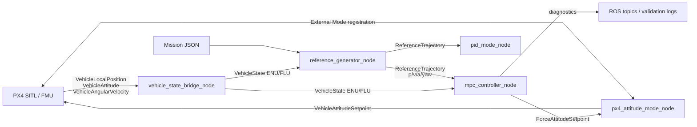
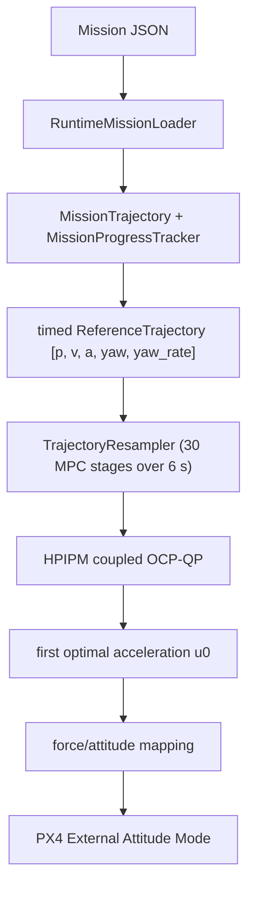
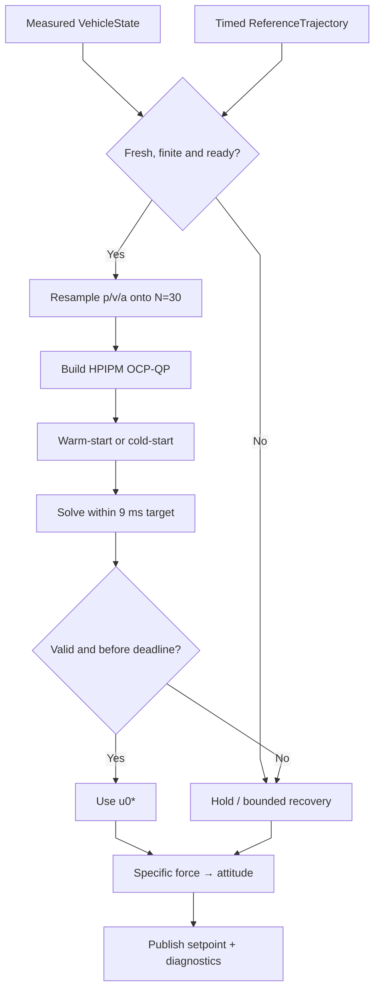
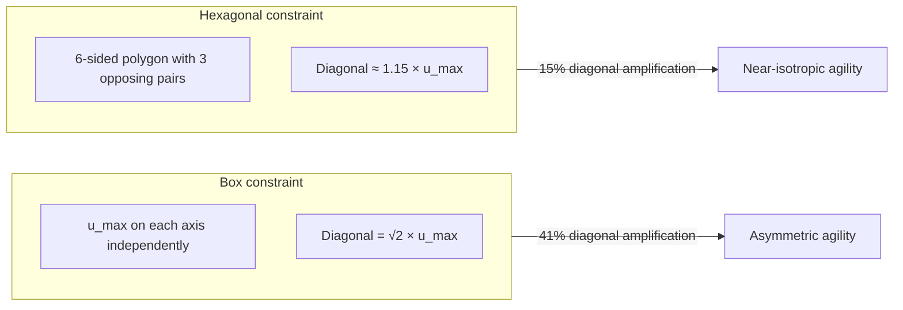

# MPC Controller for PX4

ROS 2 translational MPC for PX4 External Attitude Mode. The checked-in
runtime on this branch is a coupled 3D OCP-QP solved by HPIPM with BLASFEO.
PX4 still owns the attitude-rate loops, thrust allocation, arming, takeoff and
landing decisions.

This README describes the repository as it is checked in, not the older design
plan. The plan remains in
[`agent/MPC_V1_V2_DESIGN_PLAN.md`](agent/MPC_V1_V2_DESIGN_PLAN.md) and was not
changed by this documentation update.

## Current status

- Runtime solver: HPIPM + BLASFEO, built by default and linked to
  `mpc_controller_node`.
- Control loop: 100 Hz; prediction grid: 30 future transitions × 0.20 s;
  prediction horizon: 6.0 s.
- Reference contract: timed `p`, `v`, `a`, yaw and yaw-rate samples. The MPC
  command path no longer consumes a discrete waypoint-plan message.
- Mission execution: runtime load through
  `/reference_generator_node/load_and_start_mission`; mode selection and
  arming remain operator/PX4 responsibilities.
- The runtime solver benchmark is HPIPM-only. TinyMPC remains an optional
  offline experiment.
- Verified repository state at this checkpoint: package build passed, the
  current CTest suite passed, and `git diff --check` passed. HIL, real-flight
  validation and a current native-HPIPM full-scenario Gate D run are not
  claimed here.

## 1. Runtime architecture

`make sim` starts four processes. The attitude process contains two ROS 2
nodes: `px4_attitude_mode_node` and `vehicle_state_bridge_node`.



The authoritative data flow is:



`MissionProgressTracker` is planner-side state only. It validates measured
acceptance, dwell and completion; it does not generate a second controller
command. The MPC sees the timed trajectory and optimizes the first control
input against the complete horizon.

### Main interfaces

| Interface | Contract |
| --- | --- |
| PX4 → bridge | PX4 local position, attitude and angular velocity topics |
| `vehicle_state` | ENU position/velocity/acceleration, yaw, validity and control readiness |
| `reference_trajectory` | Timed position, velocity, acceleration, yaw, yaw-rate and tracking limits |
| `force_attitude_setpoint` | Desired acceleration, world specific force, FLU→ENU attitude and yaw-rate |
| `mpc_translational_output` | Controller command, prediction and solver diagnostics |
| `/reference_generator_node/mission_completed` | Reference-side mission completion; it is not a landing command |

The bridge subscribes directly to:

```text
/fmu/out/vehicle_local_position_v1
/fmu/out/vehicle_attitude
/fmu/out/vehicle_angular_velocity
```

The internal project frame is ENU/FLU. Conversion to PX4 NED/FRD is kept at
the PX4 adapter boundary.

## 2. Control loop and OCP-QP

The ROS callback runs at 100 Hz, independently from the sparse prediction
grid. The measured state is `x[0]`; the solver predicts `x[1] ... x[30]`.



The physical state and command are:

```math
x=[p^T,v^T,a^T]^T\in R^9,\qquad u=[u_x,u_y,u_z]^T\in R^3
```

Per axis, the acceleration-response model is:

```math
\dot p=v,\qquad \dot v=a,\qquad \dot a=(u-a)/\tau
```

The discrete implementation uses the next acceleration state for the position
and velocity update. The configured time constants are `[0.25, 0.25, 0.08] s`.
The command `u` is an acceleration request in `m/s²`; it is not jerk.

The HPIPM problem augments the 9-state physical model with the previous input,
so each OCP state has dimension 12. The current structure has 31 state nodes,
30 control stages and 22 general constraint rows per active stage. It keeps
the OCP state in the problem instead of forming a separate condensed dense
matrix.
The cost contains:

- stage and terminal tracking weights for position, velocity and acceleration;
- `R` control effort weights;
- control-rate weights on `u[k] - u[k-1]`, which smooth the commanded tilt;
- terminal weights on the last prediction node.

### Active limits

- Six-sided XY polygon for command and velocity geometry.
- Hard XY/Z command limits and hard command-rate limits over all 30 stages.
- Hard total-tilt and collective-specific-force envelope.
- Mission acceleration and jerk values can tighten the planner/reference and
  the MPC command envelope; they do not widen the configured safety limits.
- The current HPIPM path does not allocate velocity or acceleration slack
  variables; the command envelope is hard and has no runtime slack-weight
  compatibility parameters.

The first valid command is mapped as:

```math
a_{des}=u_0^*,\qquad f_{des}=a_{des}+[0,0,g]^T
```

`geometry_mapper.hpp` constructs the attitude from the desired force and yaw.
`attitude_node.cpp` converts the resulting FLU/ENU command to PX4 FRD/NED and
normalizes thrust. PX4 owns the lower attitude/rate control loops.

## 3. Mathematical formulation

This section provides the complete mathematical description of every stage in
the control pipeline, from plant modelling through trajectory generation,
optimal control formulation, constraint design, to the final force-to-attitude
mapping. All equations are derived directly from the checked-in source code.

### 3.1 Continuous-time plant model

The translational dynamics of the multirotor are modelled as a third-order
acceleration-response system **per axis** $i \in \{x, y, z\}$. The actuator
lag between the commanded acceleration $u_i$ and the achieved acceleration
$a_i$ is captured by a first-order time constant $\tau_i$:

```math
\dot{p}_i = v_i, \qquad \dot{v}_i = a_i, \qquad \dot{a}_i = \frac{u_i - a_i}{\tau_i}
```

Stacking all three axes into vectors gives the 9-dimensional physical state
$x = [p^T,\; v^T,\; a^T]^T \in \mathbb{R}^9$ and the 3-dimensional control
input $u = [u_x,\; u_y,\; u_z]^T \in \mathbb{R}^3$. The control input $u$
has units of $\text{m/s}^2$ and represents a **commanded acceleration**, not
jerk.

> **Source:** [`domain/control/mpc.hpp`](include/mpc_controller/domain/control/mpc.hpp) —
> `MeasuredState`, `Config`; [`hpipm.cpp`](src/adapters/solver/hpipm.cpp) —
> `transitionMatrix()`, `inputMatrix()`.

The configured time constants are $[\tau_x, \tau_y, \tau_z] = [0.25, 0.25, 0.08]\;\text{s}$.
A smaller $\tau_z$ reflects the faster vertical response of thrust compared to
the horizontal response through tilt.

### 3.2 Discrete-time state-space (ZOH discretization)

Given a sampling period $\Delta t$, the exact zero-order hold (ZOH)
discretization defines, per axis $i$:

```math
\alpha_i = e^{-\Delta t / \tau_i}
```

When $\tau_i = 0$ (no lag), $\alpha_i = 0$ and the command passes through
instantly: $a_{i,k+1} = u_{i,k}$.

The discrete-time physical dynamics are $x_{k+1} = A_d\, x_k + B_d\, u_k$
where $A_d \in \mathbb{R}^{9 \times 9}$ and $B_d \in \mathbb{R}^{9 \times 3}$:

```math
A_d =
\begin{bmatrix}
I_3 & \Delta t \cdot I_3 & \tfrac{1}{2}\Delta t^2 \cdot \text{diag}(\alpha) \\
0 & I_3 & \Delta t \cdot \text{diag}(\alpha) \\
0 & 0 & \text{diag}(\alpha)
\end{bmatrix}
```

```math
B_d =
\begin{bmatrix}
\tfrac{1}{2}\Delta t^2 \cdot \text{diag}(1-\alpha) \\
\Delta t \cdot \text{diag}(1-\alpha) \\
\text{diag}(1-\alpha)
\end{bmatrix}
```

where $\alpha = [\alpha_x, \alpha_y, \alpha_z]^T$ and
$\text{diag}(\cdot)$ constructs a diagonal matrix.

> **Source:** [`hpipm.cpp:L110‑L135`](src/adapters/solver/hpipm.cpp) —
> `transitionMatrix()`, `inputMatrix()`.

### 3.3 Augmented state (12 dimensions)

To penalize and constrain the **control rate** $\Delta u_k = u_k - u_{k-1}$
within the QP, the previous control input $u_{k-1} \in \mathbb{R}^3$ is
appended to the physical state, forming the augmented OCP state
$\tilde{x}_k \in \mathbb{R}^{12}$:

```math
\tilde{x}_k =
\begin{bmatrix}
p_x \\ p_y \\ p_z \\ v_x \\ v_y \\ v_z \\ a_x \\ a_y \\ a_z \\ u_{x,\text{prev}} \\ u_{y,\text{prev}} \\ u_{z,\text{prev}}
\end{bmatrix}
```

The augmented transition matrices are:

```math
\tilde{A} =
\begin{bmatrix}
A_d & 0_{9 \times 3} \\
0_{3 \times 9} & 0_{3 \times 3}
\end{bmatrix}
\in \mathbb{R}^{12 \times 12}
```

```math
\tilde{B} =
\begin{bmatrix}
B_d \\
I_3
\end{bmatrix}
\in \mathbb{R}^{12 \times 3}
```

The bottom-right zero block in $\tilde{A}$ and the $I_3$ in $\tilde{B}$ ensure
that after each step, the "previous input" slot is overwritten with the current
control: $u_{\text{prev},k+1} = u_k$.

> **Source:** [`hpipm.cpp:L358‑L377`](src/adapters/solver/hpipm.cpp) — `buildDynamics()`.

### 3.4 OCP-QP cost function

The MPC solves a finite-horizon Optimal Control Problem formulated as a
Quadratic Program (OCP-QP). The objective function has three components:
**tracking error**, **control effort**, and **control-rate smoothness**.

#### Stage cost ($k = 1, \ldots, N-1$)

```math
\ell_k(\tilde{x}_k, u_k) =
\underbrace{\sum_{d \in \{p,v,a\}} \left(
  w_{xy}^{(d)} \sum_{i \in \{x,y\}} (x_k^{(d,i)} - x_{\text{ref},k}^{(d,i)})^2
  + w_z^{(d)} (x_k^{(d,z)} - x_{\text{ref},k}^{(d,z)})^2
\right)}_{\text{tracking}}
```

```math
+ \underbrace{\sum_{i \in \{x,y\}} R_{xy}\, u_{k,i}^2 + R_z\, u_{k,z}^2}_{\text{control effort}}
+ \underbrace{\sum_{i \in \{x,y\}} R_{\Delta,xy} (u_{k,i} - u_{k-1,i})^2 + R_{\Delta,z} (u_{k,z} - u_{k-1,z})^2}_{\text{control-rate}}
```

where:
- $w_{xy}^{(d)}$ and $w_z^{(d)}$ are the stage tracking weights for derivative
  order $d \in \{0\text{=position}, 1\text{=velocity}, 2\text{=acceleration}\}$
- The configured values are `q_xy = [80, 550, 2]`, `q_z = [200, 350, 2]`

Each stage cost is scaled by $\Delta t_k / \Delta t_{\text{later}}$ to
normalize contributions from stages with different step sizes.

#### Terminal cost ($k = N$)

```math
\ell_N(\tilde{x}_N) =
\sum_{d \in \{p,v,a\}} \left(
  s_{xy}^{(d)} \sum_{i \in \{x,y\}} (x_N^{(d,i)} - x_{\text{ref},N}^{(d,i)})^2
  + s_z^{(d)} (x_N^{(d,z)} - x_{\text{ref},N}^{(d,z)})^2
\right)
```

where the terminal weights are `s_xy = [100, 600, 4]`, `s_z = [300, 400, 4]`.

#### HPIPM matrix form

In the standard OCP-QP notation used by HPIPM, the cost at each stage is:

```math
\frac{1}{2}
\begin{bmatrix} \tilde{x}_k \\ u_k \end{bmatrix}^T
\begin{bmatrix} Q_k & S_k^T \\ S_k & R_k \end{bmatrix}
\begin{bmatrix} \tilde{x}_k \\ u_k \end{bmatrix}
+
\begin{bmatrix} q_k \\ r_k \end{bmatrix}^T
\begin{bmatrix} \tilde{x}_k \\ u_k \end{bmatrix}
```

where:

- $Q_k \in \mathbb{R}^{12 \times 12}$ is diagonal, with tracking weights on
  positions [0..8] and control-rate weights on the previous-input slots [9..11].
- $R_k = 2 \cdot \text{diag}(R_{xy} + R_{\Delta,xy},\; R_{xy} + R_{\Delta,xy},\; R_z + R_{\Delta,z})$
- $S_k \in \mathbb{R}^{3 \times 12}$: the cross-term $S_k(i, 9+i) = -2 R_{\Delta,i}$
  couples $u_k$ with $u_{k-1}$ to form the $(u_k - u_{k-1})^2$ penalty.
- $q_k$ is updated each solve with $q_k^{(j)} = -2\, w_j \cdot x_{\text{ref},k}^{(j)}$.
  Reference tracking uses the linear term only because the constant
  $\|x_{\text{ref}}\|^2$ does not affect the optimal $u^*$.

> **Source:** [`hpipm.cpp:L380‑L421`](src/adapters/solver/hpipm.cpp) — `buildCost()`;
> [`hpipm.cpp:L268‑L288`](src/adapters/solver/hpipm.cpp) — reference update in `update()`.

### 3.5 Hexagonal polygon constraints on XY command and velocity

Instead of rectangular box constraints $|u_x| \leq u_{\max}$ and
$|u_y| \leq u_{\max}$, the controller uses a **regular hexagonal** constraint.
A box allows diagonal commands of magnitude $\sqrt{2}\, u_{\max}$, which is
$41\%$ larger than axial commands. The hexagonal constraint enforces a
near-circular feasible region, limiting diagonal amplification to only $15\%$.

The 6-sided regular polygon is defined by 3 opposing half-plane pairs
($j = 0, 1, 2$). Each pair uses a normal direction:

```math
\mathbf{n}_j = \begin{bmatrix} \cos\theta_j \\ \sin\theta_j \end{bmatrix}, \qquad
\theta_j = \frac{2\pi j}{6}, \quad j = 0, 1, 2
```

The constraint for each pair is:

```math
\mathbf{n}_j^T \begin{bmatrix} u_x \\ u_y \end{bmatrix} \leq u_{\max,xy} \cdot \cos\!\left(\frac{\pi}{6}\right)
```

```math
-u_{\max,xy} \cdot \cos\!\left(\frac{\pi}{6}\right) \leq \mathbf{n}_j^T \begin{bmatrix} u_x \\ u_y \end{bmatrix}
```

The same structure is applied to XY velocity with 6 full half-planes
($j = 0, \ldots, 5$):

```math
\mathbf{n}_j^T \begin{bmatrix} v_{x,k+1} \\ v_{y,k+1} \end{bmatrix} \leq v_{\max,xy} \cdot \cos\!\left(\frac{\pi}{6}\right)
```

The velocity constraint is applied to the **next-step predicted velocity**
$v_{k+1} = A_d^{(v,:)} \tilde{x}_k + B_d^{(v,:)} u_k$, so it appears in both
the $C$ (state) and $D$ (input) constraint matrices.



> **Source:** [`hpipm.cpp:L423‑L493`](src/adapters/solver/hpipm.cpp) — `buildConstraints()`;
> [`solver.hpp:L20`](include/mpc_controller/ports/solver.hpp) — `kPolygonSides = 6`.

### 3.6 Control-rate constraints (jerk limiting)

To prevent abrupt tilt changes that cause oscillation, the **control rate**
$\Delta u_k = u_k - u_{k-1}$ is hard-constrained at every stage. Using the
augmented state (where $u_{k-1}$ is stored in $\tilde{x}_k[9{:}11]$):

**XY control rate** (hexagonal, 3 opposing pairs):

```math
-\dot{u}_{\max,xy}\, \Delta t \cdot \cos\!\left(\frac{\pi}{6}\right)
\;\leq\;
\mathbf{n}_j^T
\begin{bmatrix} u_{k,x} - u_{k-1,x} \\ u_{k,y} - u_{k-1,y} \end{bmatrix}
\;\leq\;
\dot{u}_{\max,xy}\, \Delta t \cdot \cos\!\left(\frac{\pi}{6}\right)
```

In the general constraint form $C_k \tilde{x}_k + D_k u_k$, the rate rows have:
- $C_k[j, 9] = -n_{j,x}$, $C_k[j, 10] = -n_{j,y}$ (extracts $-u_{k-1,xy}$)
- $D_k[j, 0] = n_{j,x}$, $D_k[j, 1] = n_{j,y}$ (extracts $+u_{k,xy}$)

**Z control rate** (scalar box):

```math
|u_{k,z} - u_{k-1,z}| \leq \dot{u}_{\max,z} \cdot \Delta t
```

The configured limits are $\dot{u}_{\max,xy} = 8\;\text{m/s}^3$ and
$\dot{u}_{\max,z} = 4\;\text{m/s}^3$.

> **Source:** [`hpipm.cpp:L446‑L459`](src/adapters/solver/hpipm.cpp) — rate rows in
> `buildConstraints()`; [`hpipm.cpp:L248‑L253`](src/adapters/solver/hpipm.cpp) — rate
> bounds in `update()`.

### 3.7 Tilt and thrust envelope constraints

The MPC directly enforces physical safety limits on the resulting force
vector, preventing the attitude controller from receiving infeasible commands.

#### Total tilt constraint (hexagonal linearization)

The tilt angle of the multirotor is the angle between the body-Z axis
(thrust direction) and the world vertical. For a desired specific force
$\mathbf{f} = [u_x,\; u_y,\; u_z + g]^T$:

```math
\phi = \arctan\!\left(\frac{\sqrt{u_x^2 + u_y^2}}{u_z + g}\right) \leq \phi_{\max}
```

This nonlinear constraint is linearized into 6 half-planes (one per polygon
side). For each normal direction $j = 0, \ldots, 5$:

```math
n_{j,x}\, u_x + n_{j,y}\, u_y \leq \tan(\phi_{\max}) \cdot \cos\!\left(\frac{\pi}{6}\right) \cdot g
```

Note: in the constraint matrix, the tilt rows only appear in $D_k$ (input
matrix), not $C_k$, because the tilt depends solely on the command $u_k$.
The configured maximum tilt is $\phi_{\max} = 35°$.

#### Collective specific force (vertical thrust) constraint

The vertical component of the command is bounded to keep the collective
specific force within the motor capability:

```math
\max\!\left(-u_{\max,z},\;\; f_{\min} - g\right) \;\leq\; u_z \;\leq\;
\min\!\left(u_{\max,z},\;\; \sqrt{f_{\max}^2 - u_{\max,xy}^2} - g\right)
```

where:
- $f_{\min} = 1.0\;\text{m/s}^2$ (minimum collective, prevents zero-g)
- $f_{\max} = 16.0\;\text{m/s}^2$ (maximum collective, motor saturation)
- $g = 9.80665\;\text{m/s}^2$

> **Source:** [`hpipm.cpp:L474‑L489`](src/adapters/solver/hpipm.cpp) — tilt rows;
> [`hpipm.cpp:L263‑L266`](src/adapters/solver/hpipm.cpp) — thrust bounds.

### 3.8 Complete OCP-QP summary

Combining all components, the MPC solves the following OCP-QP at each control
cycle:

```math
\min_{\tilde{x}_{1:N},\, u_{0:N-1}} \;\;
\sum_{k=0}^{N-1} \left[
  \frac{1}{2} \begin{pmatrix}\tilde{x}_{k+1}\\u_k\end{pmatrix}^T
  \begin{pmatrix}Q_k & S_k^T \\ S_k & R_k\end{pmatrix}
  \begin{pmatrix}\tilde{x}_{k+1}\\u_k\end{pmatrix}
  + q_k^T \tilde{x}_{k+1}
\right]
+ \frac{1}{2} \tilde{x}_N^T Q_N \tilde{x}_N + q_N^T \tilde{x}_N
```

subject to:

| Constraint | Equation | Count per stage |
|---|---|---|
| Dynamics | $\tilde{x}_{k+1} = \tilde{A}_k \tilde{x}_k + \tilde{B}_k u_k$ | 12 equalities |
| Initial state | $\tilde{x}_0 = [\text{measured};\; u_{\text{prev}}]$ | 12 equalities |
| XY command polygon | $\mathbf{n}_j^T u_{xy} \leq r_{cmd}$ | 3 double-sided |
| XY rate polygon | $\mathbf{n}_j^T (u_{xy} - u_{prev,xy}) \leq r_{rate}$ | 3 double-sided |
| Z rate box | $\|u_z - u_{prev,z}\| \leq r_{rate,z}$ | 1 double-sided |
| XY velocity polygon | $\mathbf{n}_j^T v_{xy,k+1} \leq r_{vel}$ | 6 upper |
| Z velocity box | $\|v_{z,k+1}\| \leq v_{\max,z}$ | 2 upper |
| XY tilt polygon | $\mathbf{n}_j^T u_{xy} - \tan\phi_{\max}\cos(\pi/6)\, g \leq 0$ | 6 upper |
| Z thrust box | $f_{\min}-g \leq u_z \leq \sqrt{f_{\max}^2 - u_{\max,xy}^2}-g$ | 1 double-sided |
| **Total** | | **22 rows** |

The problem has $N = 30$ stages, $\Delta t = 0.20\;\text{s}$, giving a
prediction horizon of $6.0\;\text{s}$. HPIPM solves this OCP-QP with a
primal-dual interior-point method, targeting $9\;\text{ms}$ wall-clock time
with warm-starting from the shifted previous solution.

### 3.9 Force-to-attitude mapping (SO(3) geometry)

After the solver returns the optimal first control $u_0^*$, the force-to-
attitude mapper constructs the desired rotation matrix
$R_d = [\hat{b}_1 \;\; \hat{b}_2 \;\; \hat{b}_3] \in SO(3)$.

**Step 1 — Desired specific force:**

```math
\mathbf{f}_{des} = u_0^* + \begin{bmatrix}0\\0\\g\end{bmatrix}
= \begin{bmatrix}u_x^*\\u_y^*\\u_z^* + g\end{bmatrix}
```

**Step 2 — Body-Z axis** (thrust direction):

```math
\hat{b}_3 = \frac{\mathbf{f}_{des}}{\|\mathbf{f}_{des}\|}
```

**Step 3 — Tilt angle validation:**

```math
\phi = \arccos(\hat{b}_{3,z}) \leq \phi_{\max}
```

**Step 4 — Body-Y axis** from heading:

```math
\hat{h} = \begin{bmatrix}\cos\psi_{des}\\\sin\psi_{des}\\0\end{bmatrix}, \qquad
\hat{b}_2 = \frac{\hat{b}_3 \times \hat{h}}{\|\hat{b}_3 \times \hat{h}\|}
```

**Step 5 — Body-X axis** (completes the right-handed frame):

```math
\hat{b}_1 = \hat{b}_2 \times \hat{b}_3
```

**Step 6 — Collective thrust magnitude:**

```math
F_{collective} = \|\mathbf{f}_{des}\| \quad [\text{m/s}^2]
```

The resulting $R_d$ is converted to a unit quaternion $q_d$ and published as
the desired attitude. PX4's inner attitude-rate controller then tracks this
quaternion.

> **Source:** [`geometry_mapper.hpp:L91‑L213`](include/mpc_controller/adapters/geometry_mapper.hpp)
> — `desiredSpecificForce()`, `sanitizeDesiredSpecificForce()`, `so3Transform()`, `compute()`.

### 3.10 PX4 thrust normalization

PX4 expects a normalized body-Z thrust in $[-1, 0]$ (FRD convention). The
mapping uses PX4's real-time hover-thrust estimate $h$:

```math
T_{body,z} = -\frac{h \cdot \|\mathbf{f}_{des}\|}{g}
```

where $h \approx 0.60$ (default) is updated live by PX4's Hover Thrust
Estimator (HTE). This linearized mapping is accurate near hover and saturates
gracefully at high collective force.

> **Source:** [`geometry_mapper.hpp:L237‑L252`](include/mpc_controller/adapters/geometry_mapper.hpp)
> — `specificForceToBodyFrdZ()`.

### 3.11 ENU↔NED / FLU↔FRD frame conversions

The internal project frame is **ENU/FLU**. PX4 uses **NED/FRD**. The
conversion between frames is:

```math
\mathbf{v}_{NED} = C_{NED/ENU}\, \mathbf{v}_{ENU}, \qquad
C_{NED/ENU} = \begin{bmatrix}0 & 1 & 0\\1 & 0 & 0\\0 & 0 & -1\end{bmatrix}
```

```math
\mathbf{v}_{FLU} = C_{FLU/FRD}\, \mathbf{v}_{FRD}, \qquad
C_{FLU/FRD} = \begin{bmatrix}1 & 0 & 0\\0 & -1 & 0\\0 & 0 & -1\end{bmatrix}
```

The rotation matrix transforms as:

```math
R_{NED/FRD} = C_{NED/ENU}\, R_{ENU/FLU}\, C_{FRD/FLU}
```

Yaw conversion: $\psi_{NED} = \frac{\pi}{2} - \psi_{ENU}$, hence
$\dot{\psi}_{NED} = -\dot{\psi}_{ENU}$.

> **Source:** [`geometry_mapper.hpp:L268‑L298`](include/mpc_controller/adapters/geometry_mapper.hpp)
> — `fluEnuToFrdNed()`;
> [`geometry_mapper.hpp:L421‑L424`](include/mpc_controller/adapters/geometry_mapper.hpp)
> — `nedToEnu()`.

### 3.12 Quintic polynomial trajectory generation

Navigation segments between waypoints use **quintic (5th-degree) polynomial
splines** per axis, ensuring $C^2$ continuity (shared position, velocity and
acceleration at knots). For a segment of duration $T$ between boundary states
$(p_0, v_0, a_0)$ and $(p_f, v_f, a_f)$:

```math
p_i(t) = c_0 + c_1\, t + c_2\, t^2 + c_3\, t^3 + c_4\, t^4 + c_5\, t^5
```

The coefficients are determined by the 6 boundary conditions:

```math
\begin{aligned}
c_0 &= p_0 \\
c_1 &= v_0 \\
c_2 &= \tfrac{1}{2}\, a_0 \\
c_3 &= \frac{10\,\Delta p - 4\,\Delta v\, T + \tfrac{1}{2}\,\Delta a\, T^2}{T^3} \\
c_4 &= \frac{-15\,\Delta p + 7\,\Delta v\, T - \Delta a\, T^2}{T^4} \\
c_5 &= \frac{6\,\Delta p - 3\,\Delta v\, T + \tfrac{1}{2}\,\Delta a\, T^2}{T^5}
\end{aligned}
```

where:

```math
\Delta p = p_f - p_0 - v_0 T - \tfrac{1}{2} a_0 T^2, \quad
\Delta v = v_f - v_0 - a_0 T, \quad
\Delta a = a_f - a_0
```

The derivatives are:

```math
\begin{aligned}
\dot{p}_i(t) &= c_1 + 2c_2\, t + 3c_3\, t^2 + 4c_4\, t^3 + 5c_5\, t^4 \\
\ddot{p}_i(t) &= 2c_2 + 6c_3\, t + 12c_4\, t^2 + 20c_5\, t^3 \\
\dddot{p}_i(t) &= 6c_3 + 24c_4\, t + 60c_5\, t^2
\end{aligned}
```

#### Kinematic limit enforcement

After computing coefficients, the trajectory checks the maximum of each
derivative against kinematic bounds. The bound of a polynomial derivative is
found by locating all critical points (roots of the next derivative) and
evaluating the polynomial at those points and at the endpoints.

If any limit is violated:

```math
T \leftarrow 1.15 \cdot T
```

The duration is iteratively increased (up to 160 attempts) until all limits
are satisfied:

| Quantity | XY limit | Z limit |
|---|---|---|
| Speed | $18\;\text{m/s}$ | $3\;\text{m/s}$ |
| Acceleration | $6\;\text{m/s}^2$ | $5\;\text{m/s}^2$ |
| Jerk | $8\;\text{m/s}^3$ | $4\;\text{m/s}^3$ |

> **Source:** [`domain/model/types.hpp:L639‑L672`](include/mpc_controller/domain/model/types.hpp)
> — `TrajectoryCurve::make()`;
> [`domain/model/types.hpp:L615‑L637`](include/mpc_controller/domain/model/types.hpp)
> — `TrajectoryCurve::create()` (iterative duration scaling).

### 3.13 Reference resampling for MPC horizon

The reference generator publishes a dense timed trajectory at 50 Hz. The MPC
independently resamples this into $N = 30$ prediction points with linear
interpolation:

```math
t_k^{\text{ref}} = t_{\text{now}} + \sum_{i=0}^{k} \Delta t_i, \qquad k = 0, \ldots, N{-}1
```

where $\Delta t_0 = \Delta t_{\text{first}} = 0.20\;\text{s}$ and
$\Delta t_{i>0} = \Delta t_{\text{later}} = 0.20\;\text{s}$.

For each sample time $t_k^{\text{ref}}$, position, velocity, acceleration, yaw
and yaw-rate are linearly interpolated between the two nearest published
trajectory points. Yaw interpolation uses the shortest angular difference:

```math
\Delta\psi = \text{atan2}(\sin(\psi_2 - \psi_1),\; \cos(\psi_2 - \psi_1))
```

If the sample time exceeds the trajectory duration and `hold_after_end` is set,
the last position is held with zero velocity, acceleration and yaw-rate.

> **Source:** [`domain/model/types.hpp:L149‑L292`](include/mpc_controller/domain/model/types.hpp)
> — `TrajectoryResampler`.

## 4. Mission and reference generation

Mission schema version 1 is parsed by
[`domain/mission/loader.cpp`](src/domain/mission/loader.cpp). The reference
generator publishes a timed `ReferenceTrajectory` at 50 Hz. Its preview
settings (`horizon_seconds: 30`, `sample_period_seconds: 0.1`) are not the
MPC prediction horizon; the MPC independently samples 30 points at 0.20 s.

The generator supports `takeoff`, navigation waypoints, `hold`,
`changeSettings`, `rtl` and `land` items. Navigation segments use bounded
smooth curves with shared position/velocity/acceleration at fly-through knots.
Takeoff, explicit hold, terminal waypoints, landing and RTL are stop targets.
Yaw is kept from an explicit heading when supplied; otherwise it follows the
horizontal course and is limited by `maxHeadingRate`.

At runtime:

1. `make sim` starts with no mission and holds the latest admitted measured
   position/yaw.
2. The operator arms/takes off and selects `MPC Controller` or `PX4 PID` in
   QGroundControl.
3. The reference generator captures the current measured pose when External
   Mode becomes active.
4. `make mission-start` checks that the requested profile is the active mode,
   validates the file and atomically replaces the current mission.
5. If loading, parsing or readiness fails, the old mission is not reused; the
   generator captures a fresh measured hold.
6. On completion the reference generator holds the final reference and emits
   `mission_completed`. It does not arm, disarm, land or change PX4 mode.

```bash
make sim
# Manually arm, take off and select MPC Controller in QGroundControl.
make mission-start CONTROLLER=mpc \
  MISSION_PATH="$(pwd)/config/missions/test_polynomia.json"
```

`CONTROLLER=px4_pid` selects the comparison adapter. It is a guard for the
active External Mode, not a hot switch between controller implementations.

## 5. Repository layout

The current source layout is intentionally compact:

```text
include/mpc_controller/
  adapters/geometry_mapper.hpp       force, frame and state boundary mapping
  application/                       control and mission runtime orchestration
  compare/pid.hpp                    PX4 PID comparison reference adapter
  domain/control/{limits,mpc}.hpp    control model, limits and HPIPM-facing MPC API
  domain/mission/{loader,tracker,trajectory}.hpp
  domain/model/types.hpp             dimensions, references, sampler and validation
  ports/solver.hpp                   solver/OCP-QP contract
src/
  adapters/solver/hpipm.cpp          production OCP-QP adapter
  application/                       runtime implementations
  domain/mission/{loader,trajectory}.cpp
  nodes/attitude_node.cpp             PX4 mode + vehicle-state bridge process
  nodes/mpc_node.cpp                  MPC ROS node
  nodes/pid_node.cpp                  PID comparison ROS node
  nodes/reference_node.cpp            reference generator + mission CLI
msg/                                  ROS message contracts
srv/                                  runtime mission-load service
config/                               controller and mission JSON configuration
test/                                 unit, integration and system-test specifications
tools/                                offline benchmark and solver probes
```

The old discrete `MpcMissionPlan`/`MpcMissionWaypoint` interfaces are no
longer generated by CMake. The controller path uses `ReferenceTrajectory`.

## 6. Build and run

Requirements are ROS 2 Jazzy, `px4_msgs`, `px4_ros2_cpp`, Eigen, nlohmann-json,
Gazebo and a PX4 checkout matching the Makefile guard. The default simulator
profile is `gz_x500`; the default DDS port is 8889.

```bash
source /opt/ros/jazzy/setup.bash
make build
source install/local_setup.bash

make sim
make status
make logs
make stop
```

Useful overrides:

```bash
DDS_PORT=8890 make sim
GZ_GUI_QT_PLATFORM=wayland make sim
PX4_DIR=/path/to/PX4-Autopilot make sim
```

`make sim` preflights the ROS/PX4/Gazebo versions, starts PX4 SITL, Gazebo GUI,
Micro XRCE-DDS and the ROS launch file. It does not preload a mission and does
not arm the vehicle. `make stop` only targets processes tracked by this
Makefile; inspect `make status` if an older DDS agent owns a port.

Direct launch, without simulator orchestration:

```bash
ros2 launch mpc_controller mpc_external_mode.launch.py
```

## 7. Missions and archived tracking evidence

| File | Intended scenario |
| --- | --- |
| `benchmark_square.json` | 4 m/s square with altitude changes and final hold |
| `benchmark_obstacle_slalom.json` | 18 m/s alternating bypass waypoints and return |
| `benchmark_urban_canyon.json` | 12 m/s chicanes, U-turn and return corridor |
| `test_polynomia.json` | smooth polynomial-style waypoint approximation at 5 m |
| `test_hover_step.json` | hover and reference-step behavior |
| `test_lane_change_*.json` | short lateral transition cases |
| `test_speed_sweep.json` | requested-speed sweep |

The repository contains archived `validation_runs` metrics and ROS/PX4 logs.
Those reports identify the older runtime as "generated Acados solver SQP_RTI
with HPIPM QP feedback"; they are useful SITL evidence but are not native
measurements of the current standalone HPIPM adapter. The archive contains
10 reports: 8 overall PASS and 2 overall FAIL. The failures are retained as
diagnostic evidence rather than hidden.

Summary plot:


Trajectory animation from the archived obstacle-slalom `run_05_repeat` log:


The animation compares measured and reference XY samples from the metrics log;
it is not a claim that the current native HPIPM branch has passed the same run.

## 8. Configuration snapshot

The authoritative runtime values are in
[`config/controller.yaml`](config/controller.yaml):

| Group | Current value |
| --- | --- |
| Loop | `update_rate_hz: 100` |
| MPC grid | `dt_first: 0.20`, `dt_later: 0.20`, `N=30`, `6.0 s` |
| Deadline | `solver_deadline_seconds: 0.009`, `max_iterations: 50` |
| Model lag | `[0.25, 0.25, 0.08] s` |
| XY weights | `q_xy [80,550,2]`, `s_xy [100,600,4]` |
| Z weights | `q_z [200,350,2]`, `s_z [300,400,4]` |
| Control weights | `R_xy 1.5`, `R_delta_xy 40`, `R_z 4`, `R_delta_z 10` |
| Speed limits | XY `18`, Z `3` m/s |
| Command limits | XY `6`, Z `3` m/s² |
| Command-rate limits | XY `8`, Z `4` m/s³ |
| Mission planner limits | XY accel `6`, Z accel `5`, XY jerk `8`, Z jerk `4` |
| Force/tilt envelope | collective `1..16` m/s², total tilt `35°` |
| State admission | timeout `0.25 s`, max skew `0.10 s` |
| Reference publication | 50 Hz; visualization 20 Hz |

The runtime uses the HPIPM coupled OCP-QP backend directly. There is no
runtime solver selector or ADMM compatibility parameter; benchmark output
reports the generic problem-update, warm-start and solve timings.

## 9. Verification and validation status

Run the current package checks:

```bash
make build
ctest --test-dir build/mpc_controller --output-on-failure
git diff --check
```

The CMake suite covers PID reference handling, geometry/state mapping, runtime
control, mission loading/parsing, tracker acceptance, trajectory continuity,
reference sampling, limits, constraint layout and acceleration input envelope.
Passing unit/integration tests does not prove 100 Hz hard-real-time behavior,
full-scenario SITL, HITL or flight safety.

The next validation gate for this branch is a fresh native-HPIPM SITL run for
each scenario in the plan, with the same mission/config checksums, recorded
ROS/PX4 logs and a machine-readable report. After Gate D is complete, evaluate
HITL using [`test/system/hitl/README.md`](test/system/hitl/README.md). Do not
promote the archived Acados results or a host-only benchmark to a flight claim.

## 10. Reference documents

- [`agent/MPC_V1_V2_DESIGN_PLAN.md`](agent/MPC_V1_V2_DESIGN_PLAN.md) — unchanged
  V1/V2 plan and gates.
- [`test/system/sitl/README.md`](test/system/sitl/README.md) — SITL evidence
  requirements.
- [`test/acceptance/README.md`](test/acceptance/README.md) — acceptance
  criteria across SITL/HITL/flight.
- [`test/system/hitl/README.md`](test/system/hitl/README.md) — HITL procedure
  and prerequisites.
- [`tools/mpc_solver_benchmark.cpp`](tools/mpc_solver_benchmark.cpp) — opt-in
  deterministic solver benchmark.
