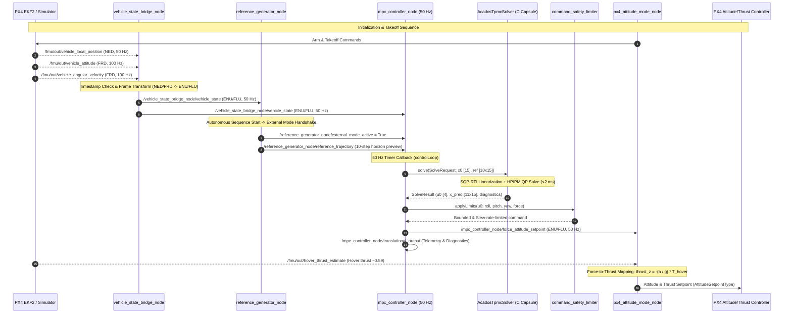

# Runtime Data Flow Map (DATA_FLOW.md)

This document traces the exact signal paths, ROS 2 topics, rates, message types, coordinate frames, and physical units across the active runtime pipeline.

---

## 1. End-to-End Runtime Signal Flow

---

## 2. Topic and Signal Flow Registry

| Step | Topic Name | Publisher Node | Subscriber Node | Message Type | Rate | Frame | Units |
| :--- | :--- | :--- | :--- | :--- | :--- | :--- | :--- |
| **1** | `/fmu/out/vehicle_local_position` | PX4 Autopilot | `vehicle_state_bridge_node` | `px4_msgs/msg/VehicleLocalPosition` | $50\text{ Hz}$ | NED | Pos: $\text{m}$, Vel: $\text{m/s}$, Acc: $\text{m/s}^2$ |
| **2** | `/fmu/out/vehicle_attitude` | PX4 Autopilot | `vehicle_state_bridge_node` | `px4_msgs/msg/VehicleAttitude` | $100\text{ Hz}$ | FRD $\to$ NED | Hamilton Quaternion $[w, x, y, z]$ |
| **3** | `/fmu/out/vehicle_angular_velocity` | PX4 Autopilot | `vehicle_state_bridge_node` | `px4_msgs/msg/VehicleAngularVelocity` | $100\text{ Hz}$ | FRD | Angular velocity: $\text{rad/s}$ |
| **4** | `/vehicle_state_bridge_node/vehicle_state` | `vehicle_state_bridge_node` | `reference_generator_node`, `mpc_controller_node` | `mpc_controller/msg/VehicleState` | $50\text{ Hz}$ | ENU / FLU | Pos: $\text{m}$, Vel: $\text{m/s}$, Yaw: $\text{rad}$, Yaw rate: $\text{rad/s}$ |
| **5** | `/reference_generator_node/reference_trajectory` | `reference_generator_node` | `mpc_controller_node` | `mpc_controller/msg/ReferenceTrajectory` | $50\text{ Hz}$ | ENU | 10 TrajectoryPoints (Pos, Vel, Acc, Yaw) |
| **6** | `/reference_generator_node/external_mode_active` | `reference_generator_node` | `mpc_controller_node` | `std_msgs/msg/Bool` | Event / $50\text{ Hz}$ | — | Boolean flag |
| **7** | `/fmu/out/hover_thrust_estimate` | PX4 Autopilot | `px4_attitude_mode_node` | `px4_msgs/msg/HoverThrustEstimate` | $2\text{ Hz}$ | — | Normalized thrust fraction $[0, 1]$ |
| **8** | `/mpc_controller_node/force_attitude_setpoint` | `mpc_controller_node` | `px4_attitude_mode_node` | `mpc_controller/msg/ForceAttitudeSetpoint` | $50\text{ Hz}$ | ENU / FLU | Quat: $[w, x, y, z]$, Specific force $a$: $\text{m/s}^2$ |
| **9** | `/mpc_controller_node/translational_output` | `mpc_controller_node` | `record_tpmc_metrics.py` | `mpc_controller/msg/MpcTranslationalOutput` | $50\text{ Hz}$ | ENU | State, Ref, Predictions, Solve time, Status |
| **10** | PX4 External Mode Attitude Stream | `px4_attitude_mode_node` | PX4 Rate Controller | `px4_ros2::AttitudeSetpointType` | $50\text{ Hz}$ | FRD $\to$ NED | Quat, Thrust: $[-1, 0]$ (NED Z-down) |
