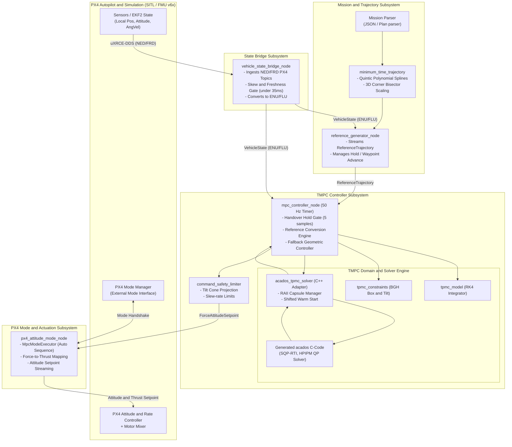

# System Architecture Map (SYSTEM_MAP.md)

This document defines the high-level system architecture and structural boundaries of the `mpc_controller` ROS 2 package.

---

## 1. Architectural Principles & Clean Architecture Compliance

The architecture strictly separates the **Domain & Application layers** (pure math, dynamics, solvers, safety checks) from the **ROS 2 & PX4 Infrastructure layer**.

1. **Domain Layer (`include/mpc_controller/solver/`, `src/solver/`)**:
   - Zero dependencies on `rclcpp`, `px4_msgs`, or ROS message definitions.
   - Pure C++17 implementations of the nonlinear 6-DoF multirotor dynamics (`tpmc_model.cpp`), state/input constraints (`tpmc_constraints.cpp`), reference conversion (`tpmc_reference.cpp`), and abstract solver port (`tpmc_solver.cpp`).
2. **Infrastructure Layer (`src/controller/`, `src/mission/`, `src/bridge/`)**:
   - `vehicle_state_bridge_node`: Ingests raw PX4 uXRCE-DDS messages, validates freshness and sample skew, transforms frames from NED/FRD to ENU/FLU, and publishes `VehicleState`.
   - `reference_generator_node`: Parses mission waypoints, computes $C^2$ continuous quintic polynomial trajectories with 3D bisector corner velocity blending, and streams physical references.
   - `mpc_controller_node`: Composition root and ROS 2 adapter orchestrating solver execution at $50\text{ Hz}$ ($20\text{ ms}$), managing handover hold gates, and providing geometric fallback.
   - `px4_attitude_mode_node`: Implements native PX4 External Mode via `px4_ros2_cpp`, manages autonomous sequence execution (Arm $\to$ Takeoff $\to$ Hold $\to$ Mission $\to$ Land), and maps specific force to normalized thrust.

---

## 2. High-Level Mermaid Architecture Diagram

---

## 3. Subsystem Boundaries and Interfaces

| Subsystem | Primary Header / Implementation | Key Responsibilities | Upstream Input | Downstream Output |
| :--- | :--- | :--- | :--- | :--- |
| **State Bridge** | [`state_bridge.hpp`](file:///home/ubuntu/Dev/mpc_controller/mpc_control/include/mpc_controller/bridge/state_bridge.hpp) / [`vehicle_state_bridge_node.cpp`](file:///home/ubuntu/Dev/mpc_controller/mpc_control/src/bridge/vehicle_state_bridge_node.cpp) | Validates timestamps, rejects stale/skewed samples, transforms NED/FRD to ENU/FLU. | `px4_msgs/msg/VehicleLocalPosition`, `VehicleAttitude`, `VehicleAngularVelocity` | `mpc_controller/msg/VehicleState` |
| **Mission / Trajectory** | [`minimum_time_trajectory.hpp`](file:///home/ubuntu/Dev/mpc_controller/mpc_control/include/mpc_controller/mission/minimum_time_trajectory.hpp) / [`reference_generator_node.cpp`](file:///home/ubuntu/Dev/mpc_controller/mpc_control/src/mission/reference_generator_node.cpp) | Computes time-optimal quintic splines, smooths corners with 3D bisector velocity, previews 10-step horizon. | Mission JSON, `VehicleState` | `mpc_controller/msg/ReferenceTrajectory`, `std_msgs/msg/Bool` (external_mode_active) |
| **TMPC Domain Model** | [`tpmc_model.hpp`](file:///home/ubuntu/Dev/mpc_controller/mpc_control/include/mpc_controller/solver/tpmc_model.hpp) / [`tpmc_model.cpp`](file:///home/ubuntu/Dev/mpc_controller/mpc_control/src/solver/tpmc_model.cpp) | Continuous 6-DoF nonlinear dynamics, actuator first/second-order lags, discrete ERK4 integrator. | State $x \in \mathbb{R}^{11}$, Input $u \in \mathbb{R}^4$, Parameters $p \in \mathbb{R}^6$ | Next state $x_{k+1}$ |
| **TMPC Constraints** | [`tpmc_constraints.hpp`](file:///home/ubuntu/Dev/mpc_controller/mpc_control/include/mpc_controller/solver/tpmc_constraints.hpp) / [`tpmc_constraints.cpp`](file:///home/ubuntu/Dev/mpc_controller/mpc_control/src/solver/tpmc_constraints.cpp) | Computes upper/lower bounds, command slew rate constraints, and evaluates nonlinear tilt cone violations. | Bounds configuration, State/Input trajectories | Constraint violation report |
| **Acados Solver Port** | [`acados_tpmc_solver.hpp`](file:///home/ubuntu/Dev/mpc_controller/mpc_control/include/mpc_controller/solver/acados_tpmc_solver.hpp) / [`acados_tpmc_solver.cpp`](file:///home/ubuntu/Dev/mpc_controller/mpc_control/src/solver/acados_tpmc_solver.cpp) | Manages ACADOS C capsule, formats NLS trigonometric residuals, performs shifted warm-start, executes SQP-RTI. | `SolveRequest` (Initial state, 10-step reference) | `SolveResult` (Optimized $u_0$, state predictions, timing/KKT diagnostics) |
| **MPC Controller Node** | [`mpc_controller_node.cpp`](file:///home/ubuntu/Dev/mpc_controller/mpc_control/src/controller/mpc_controller_node.cpp) | $50\text{ Hz}$ control loop orchestrator, state handover gate, geometric fallback engine, safety limiter. | `VehicleState`, `ReferenceTrajectory`, Hover thrust estimate | `ForceAttitudeSetpoint`, `MpcTranslationalOutput` |
| **PX4 Attitude Interface** | [`px4_attitude_mode_node.cpp`](file:///home/ubuntu/Dev/mpc_controller/mpc_control/src/controller/px4_attitude_mode_node.cpp) | Autonomous flight sequence executor, specific-force to normalized collective thrust mapping, setpoint streaming. | `ForceAttitudeSetpoint`, `px4_msgs/msg/HoverThrustEstimate` | PX4 `vehicle_attitude_setpoint` |
