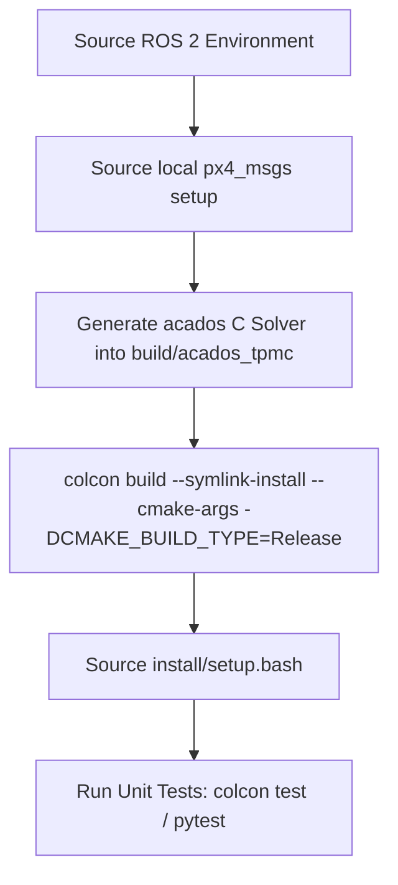

# Build & Environment Setup Guide (BUILD_AND_RUN.md)

This document provides the complete, reproducible build and environment configuration workflow for the `mpc_controller` package.

---

## 1. Prerequisites and Environment

* **Operating System**: Ubuntu 24.04 LTS (Noble) / Ubuntu 22.04 LTS (Jammy)
* **ROS 2 Distribution**: ROS 2 Jazzy Jalisco (or Iron / Humble with C++17 support)
* **C++ Compiler**: GCC 11+ / Clang 14+ supporting C++17
* **Build System**: `ament_cmake`, `colcon`
* **Python Runtime**: Python 3.10+ with `numpy`, `casadi`, `pyulog`, `matplotlib`, `pymavlink`, `jinja2`, `pytest`
* **Dependencies**:
  - `Eigen3` (Linear algebra)
  - `acados` (Nonlinear MPC C library located in `third_party/acados`)
  - `CasADi` (Symbolic algorithmic differentiation located in `third_party/casadi`)
  - `px4_msgs` (PX4 ROS 2 message definitions located in `install/px4_msgs`)
  - `px4_ros2_cpp` (PX4 ROS 2 interface library located in `third_party/px4-ros2-interface-lib`)

---

## 2. Solver Code Generation Rules

The repository embeds pre-configured symbolic models in [`tools/acados/tpmc_acados_model.py`](file:///home/ubuntu/Dev/mpc_controller/mpc_control/tools/acados/tpmc_acados_model.py).

### When is Solver Code Generation Required?
| Change Trigger | Regeneration Required? | Notes |
| :--- | :---: | :--- |
| **Model Dynamics Expression Change** | **YES** | If nonlinear equations in CasADi change. |
| **Prediction Horizon Length ($N$)** | **YES** | Changing from $N=10$ to other values alters OCP dimensions. |
| **Sample Time ($T_s$)** | **YES** | Discretization step is baked into generated RK4 integrators. |
| **Nonlinear Constraint Dimensions** | **YES** | Adding/removing BGH constraint expressions. |
| **Online Weight / Penalty Tuning ($Q, R, W_N$)** | **NO** | Set dynamically at runtime via `acados_ocp_solver_W_set()`. |
| **Physical Parameter Updates ($\tau, g$)** | **NO** | Set dynamically at runtime via `acados_update_params()`. |
| **Box Constraint Bound Tuning ($lb, ub$)** | **NO** | Set dynamically at runtime via `acados_ocp_solver_bounds_set()`. |

### Command to Regenerate ACADOS Solver:
```bash
# Set acados root and Tera renderer paths
export ACADOS_SOURCE_DIR="$PWD/third_party/acados"
export PYTHONPATH="$PWD/third_party/acados/interfaces/acados_template:$PYTHONPATH"
export TERA_PATH="$PWD/third_party/acados/bin/t_renderer"

python3 tools/acados/generate_tpmc_solver.py --output-directory build/acados_tpmc
```

---

## 3. Step-by-Step Build Workflow



### Verified Terminal Commands:
```bash
# 1. Source ROS 2 base environment
source /opt/ros/jazzy/setup.bash

# 2. Source px4_msgs local setup
source install/px4_msgs/local_setup.bash

# 3. Build package with optimized release flags
colcon build --symlink-install --cmake-args -DCMAKE_BUILD_TYPE=Release --parallel-workers 1

# 4. Source package overlay
source install/setup.bash
```

---

## 4. Troubleshooting Build Errors

1. **`No generated acados TMPC C sources found`**:
   - Run the Python generation command above to populate `build/acados_tpmc/`.
2. **`px4_msgs CMake package directory missing`**:
   - Ensure `install/px4_msgs/px4_msgs/share/px4_msgs/cmake` exists. Build `px4_msgs` first if starting from a fresh environment.
3. **RAM / Out-of-Memory during build**:
   - acados generated C files have large symbol tables. Always use `--parallel-workers 1` to prevent GCC OOM on multi-core machines with limited RAM.
