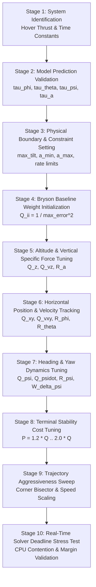

# Staged Tuning Playbook (TUNING_PLAYBOOK.md)

This playbook establishes a rigorous, 14-stage experimental tuning methodology for the TMPC controller, preventing cross-parameter coupling errors.

---

## 1. Parameter Dependency Graph

---

## 2. Staged Experimental Tuning Protocol

### Stage 1: Vehicle & Collective Force Identification
* **Objective**: Estimate $\tau_a$ and hover collective thrust $\hat{T}_{hover}$.
* **Frozen Parameters**: All MPC tracking weights.
* **Test Maneuver**: Stationary hover with vertical sinusoidal excitation (`collective_identification.launch.py`).
* **Success Criteria**: Least squares fit $R^2 \ge 0.95$, residual variance $< 0.05$.
* **Configuration Result**: Update `model_time_constants[3]` with identified $\tau_a$.

### Stage 2: Altitude & Vertical Tracking ($z, v_z, a$)
* **Objective**: Eliminate altitude sag during rapid lateral acceleration.
* **Tuned Parameters**: $Q_z, Q_{vz}, P_z, P_{vz}, R_a$.
* **Test Trajectory**: Step climb/descent ($2.5\text{ m} \to 5.0\text{ m} \to 2.5\text{ m}$ in `test_hover_step.json`).
* **Tuning Rule**: If $z$ lags behind reference, increase $Q_z$ by $20\%$; if vertical jerk or motor chattering occurs, increase $R_a$ by $15\%$.
* **Acceptance Criteria**: Altitude RMSE $\le 0.15\text{ m}$, Max $z$ error $\le 0.30\text{ m}$, zero motor saturation.

### Stage 3: Horizontal Position & Velocity Tracking ($x, y, v_x, v_y, \phi, \theta$)
* **Objective**: Minimize lateral tracking error along curved 3D paths.
* **Tuned Parameters**: $Q_x, Q_y, Q_{vx}, Q_{vy}, R_\phi, R_\theta$.
* **Test Trajectory**: `benchmark_square.json` followed by `benchmark_obstacle_slalom.json`.
* **Tuning Rule**: Increase $Q_{xy}$ until XY RMSE $< 0.50\text{ m}$. If tilt commands oscillate near corner turns, increase $R_{\phi\theta}$ or increase `yaw_command_delta_weight`.
* **Acceptance Criteria**: XY RMSE $\le 0.50\text{ m}$, Max XY error $\le 1.50\text{ m}$, Max tilt $\le 30^\circ$.

### Stage 4: Yaw Tracking & Slew Dampening ($\psi, \dot{\psi}$)
* **Objective**: Maintain smooth camera/sensor orientation along trajectory heading without overshoot.
* **Tuned Parameters**: $Q_\psi, Q_{\dot{\psi}}, R_\psi, W_{\Delta\psi}$.
* **Test Trajectory**: $180^\circ$ and $360^\circ$ waypoint heading reversals.
* **Tuning Rule**: If vehicle snaps violently at waypoint transitions, increase $W_{\Delta\psi}$ from $25.0 \to 35.0$.
* **Acceptance Criteria**: Yaw RMSE $\le 0.10\text{ rad}$ ($5.7^\circ$), yaw rate $\le 2.0\text{ rad/s}$.

### Stage 5: Terminal Weight Tuning ($P$)
* **Objective**: Guarantee Lyapunov-like contraction and ensure terminal prediction $x_N$ converges to target.
* **Tuning Rule**: Set $P = 1.5 \times Q$ for position and velocity states ($P_{xyz} = 1.5 \cdot Q_{xyz}$, $P_{v} = 1.5 \cdot Q_{v}$).

---

## 3. Experiment Recording Template

| Exp ID | Changed Parameter | Baseline Value | New Value | Test Mission | Measured XY RMSE | Measured Vel RMSE | Max Tilt | Max Solve Time | Gate Result |
| :---: | :--- | :---: | :---: | :--- | :---: | :---: | :---: | :---: | :---: |
| **E-01** | `stage_cost_weights[0:2]` | `20.0` | `25.0` | `benchmark_obstacle_slalom` | $0.402\text{ m}$ | $0.150\text{ m/s}$ | $20.6^\circ$ | $8.20\text{ ms}$ | ✅ PASS |
| **E-02** | `yaw_command_delta_weight` | `25.0` | `30.0` | `benchmark_urban_canyon` | $0.380\text{ m}$ | $0.142\text{ m/s}$ | $19.8^\circ$ | $7.85\text{ ms}$ | ✅ PASS |
