# Pass/Fail Criteria & Gate Specifications (PASS_FAIL_CRITERIA.md)

This document formalizes the 11 strict validation gates enforced by [`scripts/analysis/analyze_validation_run.py`](file:///home/ubuntu/Dev/mpc_controller/mpc_control/scripts/analysis/analyze_validation_run.py).

---

## 1. The 11 Strict Validation Gates

```mermaid
graph TD
    subgraph Gate_Pipeline["TMPC SITL Validation Gate Pipeline"]
        G1["Gate 1: no_qp_fallback (0 occurrences)"]
        G2["Gate 2: no_solver_failure (0 errors / MINSTEP)"]
        G3["Gate 3: deadline_miss_rate (0.0% > 18ms)"]
        G4["Gate 4: worst_case_timing (Max E2E <= 18ms)"]
        G5["Gate 5: hover_tilt_stability (Roll/Pitch std <= 5.0 deg)"]
        G6["Gate 6: maximum_tilt (Max tilt <= 40.0 deg)"]
        G7["Gate 7: mission_xy_tracking (RMSE <= 1.0m, Max <= 3.0m)"]
        G8["Gate 8: altitude_deviation (Max Z err <= 2.0m)"]
        G9["Gate 9: mission_velocity_tracking (RMSE <= 1.0m/s, Max <= 3.0m/s)"]
        G10["Gate 10: motor_saturation (Rate == 0.0%)"]
        G11["Gate 11: minimum_obstacle_clearance (Distance >= Margin)"]
    end
    
    G1 --> G2 --> G3 --> G4 --> G5 --> G6 --> G7 --> G8 --> G9 --> G10 --> G11
```

---

## 2. Gate Definitions, Mathematical Formulas & Thresholds

| Gate Name | Measured Quantity & Formula | Acceptance Threshold | Severity upon Failure | Source Evidence |
| :--- | :--- | :--- | :---: | :--- |
| `no_qp_fallback` | Count of cycles where solver fell back to backup controller: $N_{fallback} = \sum \mathbb{I}(\text{fallback} == \text{True})$ | **$= 0$** | **CRITICAL** | `analyze_validation_run.py:L148` |
| `no_solver_failure` | Count of solver failures, infeasible statuses, or MINSTEP flags: $N_{fail} = \sum \mathbb{I}(\text{status} \ne 0 \lor \text{minstep})$ | **$= 0$** | **CRITICAL** | `analyze_validation_run.py:L155` |
| `deadline_miss_rate` | Fraction of cycles exceeding execution deadline $T_{deadline} = 18.0\text{ ms}$: $\frac{1}{M} \sum \mathbb{I}(t_{solve} > 0.018)$ | **$\le 1.0\%$** (Nominal $0.0\%$) | **HIGH** | `analyze_validation_run.py:L162` |
| `worst_case_timing` | Maximum recorded end-to-end solve duration: $\max_{k} (t_{e2e,k})$ | **$\le 18.0\text{ ms}$** | **HIGH** | `analyze_validation_run.py:L170` |
| `hover_tilt_stability` | Standard deviation of Euler roll $\phi$ and pitch $\theta$ during hover hold window: $\sigma_\phi \le 5.0^\circ, \sigma_\theta \le 5.0^\circ$ | **$\le 5.0^\circ$** | **MEDIUM** | `analyze_validation_run.py:L178` |
| `maximum_tilt` | Maximum vehicle tilt angle across the entire mission: $\theta_{tilt} = \arccos(R_{2,2})$ | **$\le 40.0^\circ$** ($0.698\text{ rad}$) | **HIGH** | `analyze_validation_run.py:L186` |
| `mission_xy_tracking` | Horizontal position tracking Root Mean Square Error & Maximum Error: $\text{RMSE}_{xy} = \sqrt{\frac{1}{M} \sum (e_x^2 + e_y^2)}$ | **$\text{RMSE} \le 1.0\text{ m}, \text{Max} \le 3.0\text{ m}$** | **HIGH** | `analyze_validation_run.py:L194` |
| `altitude_deviation` | Maximum vertical position tracking error: $\max_k |z_k - z_{ref,k}|$ | **$\le 2.0\text{ m}$** | **HIGH** | `analyze_validation_run.py:L202` |
| `mission_velocity_tracking` | Translational velocity vector tracking Root Mean Square Error & Maximum Error: $\text{RMSE}_v = \sqrt{\frac{1}{M} \sum \|\vec{v} - \vec{v}_{ref}\|^2}$ | **$\text{RMSE} \le 1.0\text{ m/s}, \text{Max} \le 3.0\text{ m/s}$** | **MEDIUM** | `analyze_validation_run.py:L210` |
| `motor_saturation` | Fraction of fresh motor telemetry samples hitting upper/lower actuator limits $[u_{min}, u_{max}] = [0.10, 0.90]$ | **$= 0.00\%$** | **CRITICAL** | `analyze_validation_run.py:L220` |
| `minimum_obstacle_clearance` | Minimum 3D Euclidean distance to bounding obstacle obstacles defined in mission JSON: $\min_k \text{dist}(\vec{p}_k, \mathcal{O})$ | **$\ge \text{margin}$** (or `N/A` if no obstacles) | **HIGH** | `analyze_validation_run.py:L230` |

---

## 3. Overall Run Classification Rules

* **`ALL PASS`**: All 11 gate criteria are evaluated as `PASS` (or `N/A` for obstacle clearance on open waypoint tracks).
* **`FAIL`**: Any gate criteria evaluates as `FAIL`. The run report lists the exact failing metrics and timestamps.
* **`INVALID RUN`**: The vehicle failed to arm, disconnected before reaching the mission window, or produced fewer than 50 valid telemetry samples.
