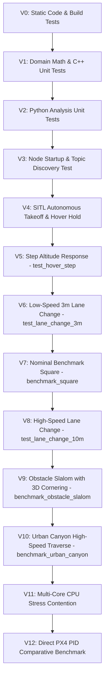

# Validation Plan & Staged Campaign Ladder (VALIDATION_PLAN.md)

This document establishes the progressive validation ladder from static unit tests to high-speed stress testing.

---

## 1. The 13-Step Validation Ladder (V0 – V12)

---

## 2. Validation Stage Specifications

| Stage | Name | Target Configuration / Mission | Key Metric Evaluated | Gate Acceptance Criteria |
| :---: | :--- | :--- | :--- | :--- |
| **V0** | **Build Integrity** | Release Build | Compilation return code | `colcon build` exit code `= 0`, 0 compiler errors |
| **V1** | **C++ Unit Tests** | `test/cpp/tpmc_core_test.cpp` | Math invariants, ERK4, BGH constraints | `colcon test` returns 0 failures, 0 errors |
| **V2** | **Python Unit Tests**| `test/python/analyze_validation_run_test.py` | Gate evaluator logic & sample age | `pytest test/` returns 6/6 PASS |
| **V3** | **Node Integration**| `mpc_offboard.launch.py` | Topic publication rates | All 5 nodes active, $50\text{ Hz}$ state/setpoint stream |
| **V4** | **SITL Hover Hold** | Takeoff to $2.5\text{ m}$ hold | Hover roll/pitch standard deviation | $\sigma_{\phi,\theta} \le 5.0^\circ$, drift $< 0.2\text{ m}$ |
| **V5** | **Altitude Step** | `test_hover_step.json` | Vertical rise time & overshoot | Max $z$ error $\le 0.30\text{ m}$, 0 motor saturation |
| **V6** | **3m Lane Change** | `test_lane_change_3m.json` | Lateral step overshoot | XY RMSE $\le 0.30\text{ m}$, Max tilt $\le 20^\circ$ |
| **V7** | **Square Benchmark**| `benchmark_square.json` | $90^\circ$ waypoint transitions | XY RMSE $\le 0.40\text{ m}$, 0 QP fallback |
| **V8** | **10m Lane Change**| `test_lane_change_10m.json` | High velocity tracking ($v \approx 8\text{ m/s}$) | XY RMSE $\le 0.60\text{ m}$, 0 deadline miss |
| **V9** | **Obstacle Slalom** | `benchmark_obstacle_slalom.json`| 3D continuous S-curve tracking | XY RMSE $\le 0.45\text{ m}$, Vel RMSE $\le 0.20\text{ m/s}$ |
| **V10** | **Urban Canyon** | `benchmark_urban_canyon.json` | Narrow corridor fly-through ($v \approx 12\text{ m/s}$) | XY Max err $\le 1.80\text{ m}$, Vel Max $\le 1.0\text{ m/s}$ |
| **V11** | **CPU Stress** | 2-Core CPU Load (`cpu_load.py`) | Worst-case solve latency under load | Max E2E Solve Time $\le 18.0\text{ ms}$ ($100\%$ margin) |
| **V12** | **PID Benchmark** | `compare_mission_logs.py` | Relative tracking error reduction vs PID | MPC achieves $\ge 40\%$ lower XY RMSE than PID |
