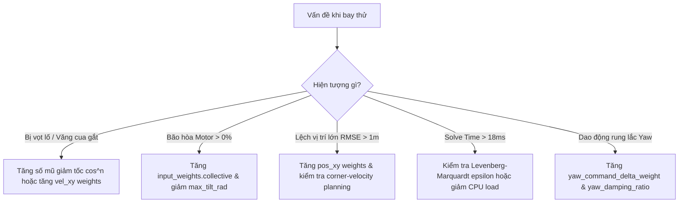

# TMPC (Translational Parameterized Model Predictive Control) Formulation & Tuning Guide

Tài liệu này tổng hợp toàn bộ **công thức toán học, mô hình động học phi tuyến, hàm mục tiêu, hệ thống ràng buộc, thuật toán tối ưu SQP-RTI và hướng dẫn tinh chỉnh (tuning)** cho bộ điều khiển TMPC của quadrotor.

---

## 1. Không gian Trạng thái & Biến Điều khiển (State-Space Formulation)

Runtime hiện tại sử dụng vector trạng thái TMPC **$x \in \mathbb{R}^{11}$** và vector điều khiển **$u \in \mathbb{R}^{4}$**:

### 1.1. Vector trạng thái ($x \in \mathbb{R}^{11}$)
$$x = x_{\text{physical}} \in \mathbb{R}^{11}$$

Trong đó:
* **11 trạng thái vật lý thực ($x_{\text{physical}} \in \mathbb{R}^{11}$):**
  $$x_{\text{physical}} = \begin{bmatrix} p_x & p_y & p_z & v_x & v_y & v_z & \phi & \theta & \psi & \dot{\psi} & f_z \end{bmatrix}^T$$
  * $p = [p_x, p_y, p_z]^T$: Vị trí trong hệ tọa độ quán tính thế giới $\text{ENU}$ $(\text{m})$.
  * $v = [v_x, v_y, v_z]^T$: Vận tốc tịnh tiến tuyến tính trong hệ $\text{ENU}$ $(\text{m/s})$.
  * $\phi, \theta, \psi$: Các góc Euler Roll, Pitch, Yaw $(\text{rad})$.
  * $\dot{\psi}$: Vận tốc góc quay quanh trục $Z$ (yaw rate) $(\text{rad/s})$.
  * $f_z = \frac{T_{\text{thrust}}}{m}$: Lực đẩy riêng toàn phần theo trục $Z$ thân xe $(\text{m/s}^2)$.

  Runtime giữ lệnh trước ở phần điều phối solver để áp đặt slew-rate và phạt biến thiên lệnh; các giá trị đó **không** nằm trong vector trạng thái 11 phần tử.

### 1.2. Vector đầu vào điều khiển ($u \in \mathbb{R}^4$)
$$u = \begin{bmatrix} u_\phi & u_\theta & u_\psi & u_f \end{bmatrix}^T$$
* $u_\phi, u_\theta$: Lệnh góc nghiêng Roll và Pitch mong muốn $(\text{rad})$.
* $u_\psi$: Lệnh góc xoay Yaw mong muốn $(\text{rad})$.
* $u_f$: Lệnh lực đẩy riêng mong muốn $(\text{m/s}^2)$.

---

## 2. Mô hình Động học Phi tuyến Liên tục (Nonlinear Dynamics)

Mô hình trạng thái liên tục: $\dot{x}_{\text{physical}} = f(x_{\text{physical}}, u, p_{\text{param}})$

### 2.1. Động học tịnh tiến (Translational Dynamics)
$$\dot{p} = v = \begin{bmatrix} v_x \\ v_y \\ v_z \end{bmatrix}$$

Vector trục $Z$ của thân xe trong hệ tọa độ quán tính $\text{ENU}$ ($z_B = R(\psi, \theta, \phi) e_3$):
$$z_B = \begin{bmatrix} \cos\psi \sin\theta \cos\phi + \sin\psi \sin\phi \\ \sin\psi \sin\theta \cos\phi - \cos\psi \sin\phi \\ \cos\theta \cos\phi \end{bmatrix}$$

Phương trình gia tốc tịnh tiến:
$$\dot{v} = z_B \cdot f_z - \begin{bmatrix} 0 \\ 0 \\ g \end{bmatrix} = \begin{bmatrix} (\cos\psi \sin\theta \cos\phi + \sin\psi \sin\phi) f_z \\ (\sin\psi \sin\theta \cos\phi - \cos\psi \sin\phi) f_z \\ (\cos\theta \cos\phi) f_z - g \end{bmatrix}$$
với $g \approx 9.80665\text{ m/s}^2$ là gia tốc trọng trường.

### 2.2. Động học góc nghiêng Roll/Pitch & Lực đẩy (First-Order Lag Models)
Góc nghiêng và đáp ứng lực đẩy của động cơ/ESC được mô hình hóa qua khâu quán tính bậc nhất:
$$\dot{\phi} = \frac{u_\phi - \phi}{\tau_\phi}, \quad \dot{\theta} = \frac{u_\theta - \theta}{\tau_\theta}, \quad \dot{f}_z = \frac{u_f - f_z}{\tau_f}$$
với $\tau_\phi, \tau_\theta, \tau_f$ là các hằng số thời gian đáp ứng $(\text{giây})$.

### 2.3. Động học góc xoay Yaw (Second-Order Model với Sai số Góc Tuần hoàn)
Động học góc yaw được mô hình hóa qua hệ dao động bậc hai:
$$\dot{\psi} = \dot{\psi}$$
$$\ddot{\psi} = \omega_{yaw}^2 \cdot \text{atan2}\big(\sin(u_\psi - \psi), \cos(u_\psi - \psi)\big) - 2 \zeta_{yaw} \omega_{yaw} \dot{\psi}$$
* $\omega_{yaw}$: Tần số dao động tự nhiên $(\text{rad/s})$.
* $\zeta_{yaw}$: Hệ số suy giảm dao động (damping ratio).
* $\text{atan2}(\sin(\cdot), \cos(\cdot))$: Đảm bảo sai số điều khiển góc lái luôn nằm trong khoảng $[-\pi, \pi]$ mà không bị quay ngược vòng lớn.

---

## 3. Rời rạc hóa Tích phân số (RK4 Discretization)

Hệ thống được rời rạc hóa với chu kỳ trích mẫu $T_s = 0.05\text{ s}$ ($20\text{ Hz}$ trong OCP, thực thi ở $50\text{ Hz}$) bằng phương pháp **Runge-Kutta bậc 4 (RK4)**:

$$k_1 = f(x_k, u_k)$$
$$k_2 = f\left(x_k + \frac{T_s}{2} k_1, u_k\right)$$
$$k_3 = f\left(x_k + \frac{T_s}{2} k_2, u_k\right)$$
$$k_4 = f\left(x_k + T_s k_3, u_k\right)$$
$$x_{k+1, \text{physical}} = x_{k, \text{physical}} + \frac{T_s}{6} (k_1 + 2k_2 + 2k_3 + k_4)$$
$$u_{\text{prev}, k+1} = u_k$$

---

## 4. Hàm Mục tiêu Phi tuyến (Nonlinear Least-Squares Cost Function)

Bài toán tối ưu trong chân trời dự đoán $N = 10$:
$$\min_{x, u} \sum_{k=0}^{N-1} \frac{1}{2} \| y(x_k, u_k) - y_k^{\text{ref}} \|_{W}^2 + \frac{1}{2} \| y_N(x_N) - y_N^{\text{ref}} \|_{W_N}^2$$

### 4.1. Khử gián đoạn kỳ dị góc Yaw qua phép ánh xạ lượng giác
Để triệt tiêu hiện tượng đạo hàm bị gián đoạn khi $\psi$ vượt qua ranh giới $\pm \pi$, phần dư góc yaw được ánh xạ sang không gian $(\sin, \cos) \in \mathbb{R}^2$:

$$r_{\psi}(x_k) = \begin{bmatrix} \sin\psi_k - \sin\psi_k^{\text{ref}} \\ \cos\psi_k - \cos\psi_k^{\text{ref}} \end{bmatrix}$$

Bình phương phần dư này có đặc tính giải tích trơn:
$$\|r_\psi\|^2 = (\sin\psi_k - \sin\psi_k^{\text{ref}})^2 + (\cos\psi_k - \cos\psi_k^{\text{ref}})^2 = 2 - 2\cos(\psi_k - \psi_k^{\text{ref}}) = 4\sin^2\left(\frac{\psi_k - \psi_k^{\text{ref}}}{2}\right)$$
* Khi $\Delta \psi \to 0$: $4\sin^2(\Delta \psi / 2) \approx (\Delta \psi)^2$.
* Khả vi vô hạn bậc hai ($C^\infty$), triệt tiêu hoàn toàn bước nhảy kỳ dị tại $\pm \pi$.

### 4.2. Vector phần dư từng bước (Stage Residual $y(x_k, u_k)$)
$$y(x_k, u_k) = \begin{bmatrix}
p_x \\ p_y \\ p_z \\
v_x \\ v_y \\ v_z \\
\phi \\ \theta \\
\dot{\psi} \\ f_z \\
\sin\psi \\ \cos\psi \\
u_\phi \\ u_\theta \\ u_f \\
\sin u_\psi \\ \cos u_\psi \\
\sin(u_\psi - u_{\psi, \text{prev}}) \\ \cos(u_\psi - u_{\psi, \text{prev}})
\end{bmatrix} \in \mathbb{R}^{19}$$

Ma trận trọng số từng bước $W = \text{diag}(Q_p, Q_v, Q_{\phi\theta}, Q_{\dot{\psi}}, Q_{f_z}, W_{\psi}, W_{\psi}, R_{\phi\theta}, R_{f}, R_{u\psi}, R_{u\psi}, W_{\Delta\psi}, W_{\Delta\psi})$.

### 4.3. Vector phần dư đầu cuối (Terminal Residual $y_N(x_N)$)
$$y_N(x_N) = \begin{bmatrix}
p_{x, N} & p_{y, N} & p_{z, N} & v_{x, N} & v_{y, N} & v_{z, N} & \phi_N & \theta_N & \dot{\psi}_N & f_{z, N} & \sin\psi_N & \cos\psi_N
\end{bmatrix}^T \in \mathbb{R}^{12}$$
với ma trận trọng số đầu cuối $W_N = \text{diag}(Q_{p, N}, Q_{v, N}, Q_{\phi\theta, N}, Q_{\dot{\psi}, N}, Q_{f_z, N}, W_{\psi, N}, W_{\psi, N})$.

---

## 5. Hệ thống Ràng buộc (Constraints Formulation)

### 5.1. Ràng buộc hộp trạng thái & đầu vào (Box Bounds)
* **Góc nghiêng từng trục:** $-\phi_{\text{max}} \le \phi_k, \theta_k \le \phi_{\text{max}}$ (mặc định $45^\circ = 0.7854\text{ rad}$)
* **Vận tốc góc yaw:** $-\dot{\psi}_{\text{max}} \le \dot{\psi}_k \le \dot{\psi}_{\text{max}}$ (mặc định $\pm 2.0\text{ rad/s}$)
* **Lực đẩy riêng:** $f_{z, \text{min}} \le f_{z, k} \le f_{z, \text{max}}$ (mặc định $[7.0, 14.0]\text{ m/s}^2$)
* **Lệnh điều khiển:** $-\phi_{\text{max}} \le u_{\phi, k}, u_{\theta, k} \le \phi_{\text{max}}$, $f_{z, \text{min}} \le u_{f, k} \le f_{z, \text{max}}$

### 5.2. Ràng buộc tốc độ biến thiên lệnh điều khiển (Input Slew Rate)
$$-\Delta u_{\text{tilt, max}} \le u_{\phi, k} - u_{\phi, \text{prev}, k} \le \Delta u_{\text{tilt, max}}$$
$$-\Delta u_{\text{tilt, max}} \le u_{\theta, k} - u_{\theta, \text{prev}, k} \le \Delta u_{\text{tilt, max}}$$
$$-\Delta u_{\text{yaw, max}} \le u_{\psi, k} - u_{\psi, \text{prev}, k} \le \Delta u_{\text{yaw, max}}$$
$$-\Delta u_{f, \text{max}} \le u_{f, k} - u_{f, \text{prev}, k} \le \Delta u_{f, \text{max}}$$

### 5.3. Ràng buộc nón góc nghiêng toàn phần phi tuyến (Nonlinear Tilt Cone)
Để giới hạn góc nghiêng không gian $3\text{D}$ thực tế của drone dưới $\theta_{\text{tilt, max}}$:
$$z_{B, z} = \cos\theta \cos\phi \ge \cos(\theta_{\text{tilt, max}})$$
* Với $\theta_{\text{tilt, max}} = 45^\circ$: $h(x) = \cos\theta \cos\phi \ge \frac{\sqrt{2}}{2} \approx 0.7071$.
* Công thức này tránh điểm kỳ dị đạo hàm của hàm $\arccos$ tại biên ràng buộc.

---

## 6. Quy hoạch Quỹ đạo Góc cua (Corner-Velocity Planning)

Khi nối các waypoint $\mathcal{W}_i \to \mathcal{W}_{i+1} \to \mathcal{W}_{i+2}$, thuật toán tự động làm mượt tại đỉnh rẽ:

### 6.1. Hướng vận tốc tại đỉnh cua
Gọi $\vec{d}_{\text{in}} = \frac{\mathcal{W}_{i+1} - \mathcal{W}_i}{\|\mathcal{W}_{i+1} - \mathcal{W}_i\|}$ và $\vec{d}_{\text{out}} = \frac{\mathcal{W}_{i+2} - \mathcal{W}_{i+1}}{\|\mathcal{W}_{i+2} - \mathcal{W}_{i+1}\|}$.

Vector vận tốc tại đỉnh waypoint $\mathcal{W}_{i+1}$ là **phân giác không gian $3\text{D}$**:
$$\vec{u}_{\text{bisector}} = \frac{\vec{d}_{\text{in}} + \vec{d}_{\text{out}}}{\|\vec{d}_{\text{in}} + \vec{d}_{\text{out}}\|}$$

### 6.2. Hàm giảm tốc độ theo góc cua
Góc chuyển hướng: $\theta_{\text{turn}} = \arccos(\vec{d}_{\text{in}} \cdot \vec{d}_{\text{out}}) \in [0, \pi]$.

Độ lớn vận tốc tại đỉnh rẽ:
$$v_{\text{corner}} = v_{\text{nominal}} \cdot \cos^3\left(\frac{\theta_{\text{turn}}}{2}\right)$$
* **Đường thẳng ($\theta_{\text{turn}} = 0$):** $v_{\text{corner}} = v_{\text{nominal}} \cdot 1^3 = v_{\text{nominal}}$ (giữ nguyên vận tốc tối đa).
* **Cua vuông $90^\circ$ ($\theta_{\text{turn}} = \frac{\pi}{2}$):** $v_{\text{corner}} = v_{\text{nominal}} \cdot \cos^3(45^\circ) \approx 0.354 \cdot v_{\text{nominal}}$ (giảm về $35.4\%$).
* **Quay đầu $180^\circ$ ($U\text{-turn}$):** $v_{\text{corner}} = v_{\text{nominal}} \cdot \cos^3(90^\circ) = 0\text{ m/s}$ (dừng an toàn).

---

## 7. Bảng Tra cứu Tham số & Hướng dẫn Tuning (Tuning Guide)

Tệp cấu hình chính: [`config/controller.yaml`](config/controller.yaml)

### 7.1. Bảng Trọng số & Ý nghĩa
| Tham số | Giá trị chuẩn | Ý nghĩa & Quy tắc hiệu chỉnh (Bryson's Rule) |
| :--- | :--- | :--- |
| `stage_weights.pos_xy` | `20.0` | Hai phần tử đầu của `stage_weights`; chỉ thay đổi sau khi có dữ liệu lặp cho thấy lệch vị trí có hệ thống. |
| `stage_weights.pos_z` | `80.0` | Phần tử độ cao; giữ lớn hơn XY trong baseline hiện tại. |
| `stage_weights.vel_xy` | `25.0` | Phạt sai số vận tốc ngang. Tăng nếu drone bị vọt lố (overshoot) khi phanh. |
| `stage_weights.vel_z` | `60.0` | Phạt sai số vận tốc đứng. Giữ ổn định trục leo/hạ. |
| `stage_weights.roll_pitch`| `5.0` | Phạt roll/pitch trong state cost; hard tilt envelope vẫn do safety limiter bảo vệ. |
| `stage_weights.yaw` | `5.0` | Phạt sai số yaw trong state cost. |
| `stage_weights.yaw_rate` | `20.0` | Phạt tốc độ quay yaw. |
| `stage_weights.collective`| `15.0` | Phạt collective-specific-force state. |
| `input_weights.tilt` | `80.0` | Phạt lệnh roll/pitch; giá trị hiện tại đã được xác nhận qua SITL. |
| `input_weights.collective`| `20.0` | Phạt lệnh lực đẩy $u_f$. Tăng để chống bão hòa motor ($0\%$ saturation). |
| `yaw_command_delta_weight`| `25.0` | Phạt biến thiên lệnh yaw $\Delta u_\psi$. |
| `terminal_weights.*` | Theo mảng trong `config/controller.yaml` | Không tự suy ra theo quy tắc chung; phải đồng bộ với runtime và solver generator. |

---

### 7.2. Quy trình xử lý lỗi thường gặp khi Tuning



---

## 8. Lệnh Kiểm thử & Xác thực Tự động (Validation Commands)

```bash
# 1. Chạy toàn bộ Unit Tests & Regression Tests
colcon test --packages-select mpc_controller && colcon test-result --verbose
pytest test/

# 2. Reset magnetometer SITL preflight through the PX4 MAVLink shell.
#    Do this only while the vehicle is disarmed and the simulator is stopped.
PX4_DIR=${PX4_DIR:-/home/ubuntu/PX4_17/PX4-Autopilot}
python3 "$PX4_DIR/Tools/mavlink_shell.py" udp:127.0.0.1:14540
# At the PX4 shell prompt:
#   param reset CAL_MAG0_XOFF
#   param reset CAL_MAG0_YOFF
#   param reset CAL_MAG0_ZOFF
#   param save
# Then restart SITL and wait for QGroundControl/PX4 to report Ready for takeoff.
# Never edit parameters.bson directly: it is a generated binary artifact and
# direct byte patching can corrupt the parameter store or hide calibration state.

# 3. Thực thi nhiệm vụ & Đánh giá 11 Gate Criteria (ALL PASS)
SIM_LOG_XTERM=0 ROS_LAUNCH_ARGS="mission_file_path:=$PWD/config/missions/benchmark_obstacle_slalom.json" make sim
make mission-execute
make stop
make validation-report MISSION_JSON=config/missions/benchmark_obstacle_slalom.json
```

### 8.1. HIL, replay và soak test

SITL gate PASS không thay thế HIL hoặc flight replay. HIL yêu cầu flight
controller thật đã kết nối qua serial và được kiểm tra trước khi build/upload:

```bash
make hil-check HIL_DEVICE=/dev/ttyACM0
make hil-firmware
make hil-upload HIL_DEVICE=/dev/ttyACM0
make hil
```

Nếu không có flight controller/ULog thì không đánh dấu HIL là PASS. Soak test
có thể lặp mission đã đạt gate và giữ riêng CSV/report từng run; theo dõi
`free -h`, deadline miss, solver fallback, motor saturation và timing p95/max.
Không chạy build song song với SITL hoặc stress test.

### 8.2. Clearance do path planner sở hữu

Các mission waypoint hiện tại không chứa obstacle geometry nên gate
`minimum_obstacle_clearance` được báo `N/A`. Đây là trạng thái có chủ ý, không
phải là clearance bằng không. Để bật gate bắt buộc mà không sao chép geometry
vào mission JSON, path planner cần xuất một trong các giao diện sau:

1. topic ROS có `minimum_clearance_m`, `closest_obstacle_id` và timestamp cho
   từng sample; recorder ghi chúng vào CSV; hoặc
2. sidecar artifact của planner chứa cùng các trường và được truyền rõ ràng
   vào validation report.

Khi chưa có artifact/topic này, không được tự điền obstacle dimensions hay
đánh dấu clearance PASS. Các đại lượng vận tốc trong report dùng đơn vị m/s;
clearance dùng mét.
